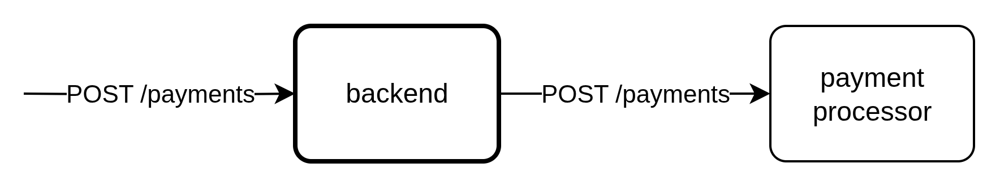
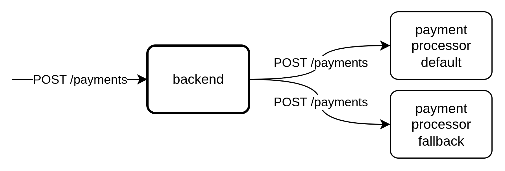
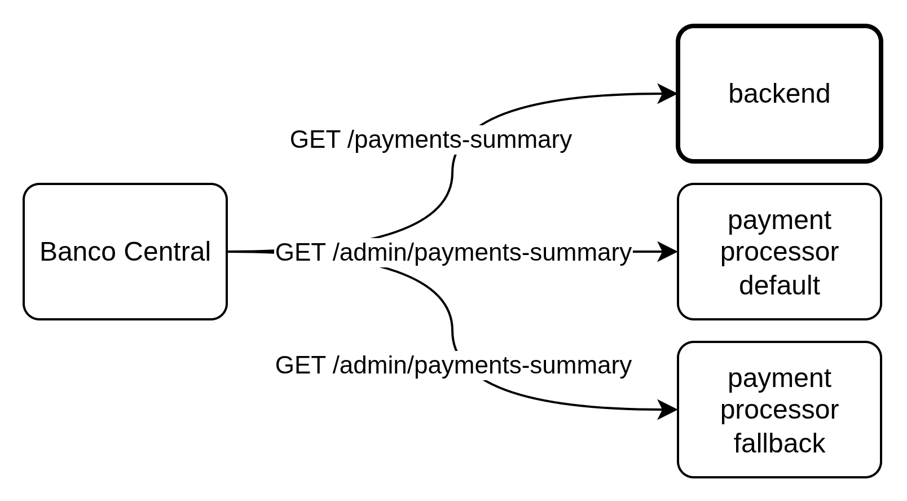

# Instruções para a Rinha de Backend - 2025

## Desafio
Sua equipe e/ou você precisa desenvolver um backend que intermedie solicitações de pagamentos para um serviço de processamento de pagamentos, chamado de Payment Processor.



Para cada pagamento intermediado, uma taxa financeira é cobrada. Por exemplo, com uma taxa de 5% para uma solicitação de pagamento de \$100,00; você seria cobrado \$5,00 e ficaria com $95,00.

Entretanto, como a vida de verdade é dura, esse serviço irá sofrer instabilidades. Os tempos de resposta dele poderá ficar muito alto e poderá até começar a ficar indisponível respondendo com erros HTTP 500. E como sabemos que a vida é dura, nós nos preparamos para essas coisas e criamos um plano B. O plano B, é que existe um segundo serviço Payment Processor.



**Observação**: As taxas sobre os processamentos de pagamentos não irão mudar durante o testes e o serviço default sempre terá a menor taxa.

O problema é que esse serviço de contingência – chamado de Payment Processor Fallback – cobra uma taxa maior sobre os pagamentos. E ele também poderá sofrer instabilidades e indisponibilidade! Inclusive, os dois serviços poderão ficar instáveis e/ou indisponíveis ao mesmo tempo, pois a vida é assim...

#### Nada é tão ruim que não possa piorar...

Além do endpoint `POST /payments`, também é necessário disponibilizar um endpoint que detalha o resumo dos pagamentos processados – `GET /payments-summary`. Esse endpoint será usado para auditar a consistência entre o que foi processado pelo seu backend e o que foi processado pelos dois Payment Processors. É o Banco Central verificando se você está registrando tudo certinho de tempos em tempos.



Essas chamadas periódicas durante o teste da Rinha vão comparar as respostas e, a cada inconsistência, uma multa salgada será aplicada!

#### A Vida é uma Montanha Russa Mesmo...

Para facilitar sua vida e a verificação da disponibilidade dos Payment Processors, em cada um deles é fornecido um endpoint de **health-check** – `GET /payments/service-health` – que mostra se o serviço está enfrentando falhas e qual é o tempo mínimo de resposta para o processamento de pagamentos. Entretanto, este endpoint possui um limite de uma chamada para cada cinco segundos. Caso este limite seja ultrapassado, uma resposta `HTTP 429 - Too Many Requests` será retornada. Você poderá usar esses endpoints para desenvolver a melhor estratégia para pagar a menor taxa possível.

## Pontuação

O critério de pontuação da Rinha de Backend será quanto de lucro seu backend conseguiu ter ao final do teste. Ou seja, quanto mais pagamentos você fizer com a menor taxa financeira, melhor. Lembre-se de que se houver inconsistências detectadas pelo Banco Central, você terá que pagar uma multa de 35% sobre o total de lucro.

Existe um critério técnico para pontuação também. Se seu backend e os Payment Processors tiverem tempos de respostas muito rápidos, você poderá pontuar também. A métrica usada para performance será o p99 (pegaremos o 1% piores tempos de resposta - percentil 99). A partir de um p99 de 10ms para menos, você recebe um bônus sobre seu total lucro de 2% para cada 1ms abaixo de 11ms.

A fórmula para a porcentagem de bônus por performance é `(11 - p99) * 0,02`. Se o valor for negativo, o bônus é 0% – não há penalidade para resultados com p99 maiores que 11ms.

Exemplos:
- p99 de 10ms = 2% de bônus
- p99 de 9ms = 4% de bônus
- p99 de 5ms = 12% de bônus
- p99 de 1ms = 20% de bônus

*¹ O percentil será calculado em cima de todas as requisições HTTP feitas no teste e não apenas em cima das requisições feitas para o seu backend.*

*² Todos os pagamentos terão exatamente o mesmo valor – não serão gerados valores aleatórios.*

## Arquitetura, Restrições e Submissão

Seu backend deverá seguir a arquitetura/restrições seguintes.

**Web Servers**: Possuir pelo menos duas instâncias de servidores web que irão responder às requisições `POST /payments` e `GET /payments-summary`. Ou seja, alguma forma de distribuição de carga deverá ocorrer (geralmente através de um load balancer como o nginx, por exemplo).

**Conteinerização**: Você deverá disponibilizar seu backend no formato de docker compose. Todas as imagens declaradas no docker compose (`docker-compose.yml`) deverão estar publicamente disponíveis em registros de imagens (https://hub.docker.com/ por exemplo).

Você deverá restringir o uso de CPU e Memória em 1,5 unidades de CPU e 350MB de memória entre todos os serviços declarados como quiser através dos atributos `deploy.resources.limits.cpus` e `deploy.resources.limits.memory` como no exemplo do trecho seguinte.

```yml
services:
  seu-servico:
    ...
    deploy:
      resources:
        limits:
          cpus: "0.15"
          memory: "42MB"
```

Exemplos de `docker-compose.yml` [aqui](participantes/luizcordista-go/docker-compose.yml), [aqui](participantes/d4vz/docker-compose.yaml) e [aqui](participantes/willzada-aGOrinha/docker-compose.yml).

**Porta 9999**: Seus endpoints deverão estar expostos na porta `9999` acessíveis via `http://localhost:9999` – exemplo [aqui](https://github.com/zanfranceschi/rinha-de-backend-2025/blob/c1fef63d23ee7cab54ebd1fd03cb20565536947c/participantes/luizcordista-go/docker-compose.yml#L11).

##### Outras restrições

- As imagens devem ser compatíveis com linux-amd64.
- O modo de rede deve ser **bridge** – o modo **host** não é permitido.
- Não é permitido modo **privileged**.
- Não é permitido uso de serviços [replicados](https://docs.docker.com/reference/compose-file/deploy/#replicas) – isso dificulta a verificação dos recursos usados.

#### Submissão

**Importante!**: A data final para submeter seu backend é **2025-08-17 até as 23:59:59**! A previsão para a divulgação dos resultados é para o dia **2025-08-20**.

Para ter seu backend testado oficialmente pela Rinha de Backend, ver os resultados em comparação com outras submissões e ter seu nome listado como participantes, você precisará fazer o seguinte:

- Ter um repositório git (github, por exemplo) público com o código fonte e todos os artefatos relacionados a submissão da Rinha.

- Abrir um PR neste repositório adicionando um diretório com sua identificação em [participantes](participantes/). Neste PR você deverá:
    - Incluir um `README.md` explicando as tecnologias que usadas e um link para o repositório com o código fonte da sua submissão.
    - Incluir o arquivo `docker-compose.yml` na raiz desse repositório com suas dependências (scripts de banco, configurações, etc.).
    - Incluir um arquivo `info.json` com a seguinte estrutura para facilitar a coleta das tecnologias usadas:
    ```json
    {
        "name": "Débora Nis Zanfranceschi",
        "social": ["https://x.com/debora-zan", "https://bsky.app/profile/debora-zan.bsky.social"],
        "source-code-repo": "https://github.com/debora-zan/rinha-de-backend-2025",
        "langs": ["node"],
        "storages": ["postgresql", "redis"],
        "messaging": ["rabbitmq", "nats"],
        "load-balancers": ["nginx"],
        "other-technologies": ["xpto"] // inclua qq coisa que não se encaixe nas outra categorias
    }
    ```
    - Exemplo de estrutura de arquivos de um PR de submissão:
    ```
    ├─ participantes/
    |  ├─ debs-node-01/
    |  |  ├─ docker-compose.yml
    |  |  ├─ info.json
    |  |  ├─ nginx.config
    |  |  ├─ sql/
    |  |  |  ├─ ddl.sql
    |  |  |  ├─ dml.sql
    |  |  ├─ README.md
    ```

**Importante!**
- Não incluir código fonte na submissão.
- Não incluir logs na submissão.
- Inclua APENAS o que for necessário para a execução dos testes.
- Se atente às restrições de CPU e memória.

## E Como me Integro com os Payment Processors???

Os Payment Processors serão executados em containers também através do arquivo `docker-compose.yml` (ou `docker-compose-arm64.yml` para hosts que usam processadores ARM64 como modelos mais novos do MacOS). Os arquivos para conteinerização deles estão [nesse diretório](./payment-processor/).

É importante notar que seu `docker-compose.yml` declare a rede usada nos Payment Processors. Isso sigifica que você precisa primeiro subir os Payment Processors para que a rede deles seja criada antes de você subir seu backend. Você também precisará incluir a rede `payment-processor` nos serviços que irão integrar com os Payment Processors, como [nesse exemplo](https://github.com/zanfranceschi/rinha-de-backend-2025/blob/c1fef63d23ee7cab54ebd1fd03cb20565536947c/participantes/luizcordista-go/docker-compose.yml#L33). Não esqueça de também declarar a rede `payment-processor` no seu arquivo `docker-compose.yml`, como [nesse exemplo](https://github.com/zanfranceschi/rinha-de-backend-2025/blob/c1fef63d23ee7cab54ebd1fd03cb20565536947c/participantes/luizcordista-go/docker-compose.yml#L74).

Depois de tudo configurado em termos de redes, os dois Payment Processors estarão disponíveis nos seguintes endereços para seus serviços:

**Payment Processor Default** em `http://payment-processor-default:8080`
**Payment Processor Fallback** em `http://payment-processor-fallback:8080`

Agora é só fazer uma referência a estes dois endereços, como [nesse exemplo](https://github.com/zanfranceschi/rinha-de-backend-2025/blob/c1fef63d23ee7cab54ebd1fd03cb20565536947c/participantes/luizcordista-go/docker-compose.yml#L49).

Esses dois endereços também estão acessíveis via host para que você consiga acessá-los para explorar nos seguintes endereços:

**Payment Processor Default** em http://localhost:8001
**Payment Processor Fallback** em http://localhost:8002

## Testando Localmente

Sigas [estas instruções](rinha-test/README.md) para testar seu backend localmente.

O [leonardosegfault](https://github.com/leonardosegfault) gentilmente elaborou um [mini-guia de setup](rinha-test/MINIGUIA.md) para ajudar na configuração local para rodar os testes.

## Detalhes dos Endpoints

### Endpoints que seu Backend Deverá Disponibilzar

#### Payments
Principal endpoint que recebe requisições de pagamentos a serem processados.
```
POST /payments
{
    "correlationId": "4a7901b8-7d26-4d9d-aa19-4dc1c7cf60b3",
    "amount": 19.90
}

HTTP 2XX
Qualquer coisa
```
**requisição**
- `correlationId` é um campo obrigatório e único do tipo UUID.
- `amount` é um campo obrigatório do tipo decimal.

**resposta**
- Qualquer resposta na faixa 2XX (200, 201, 202, etc) é válida. O corpo da resposta não será validado – pode ser qualquer coisa ou até vazio.

#### Payments Summary
Este endpoint precisa retornar um resumo do que já foi processado em termos de pagamentos.
```
GET /payments-summary?from=2020-07-10T12:34:56.000Z&to=2020-07-10T12:35:56.000Z

HTTP 200 - Ok
{
    "default" : {
        "totalRequests": 43236,
        "totalAmount": 415542345.98
    },
    "fallback" : {
        "totalRequests": 423545,
        "totalAmount": 329347.34
    }
}
```
**requisição**
- `from` é um campo opcional de timestamp no formato ISO em UTC (geralmente 3 horas a frente do horário do Brasil).
- `to` é um campo opcional de timestamp no formato ISO em UTC.

**resposta**
- `default.totalRequests` é um campo obrigatório do tipo inteiro.
- `default.totalAmount` é um campo obrigatório do tipo decimal.
- `fallback.totalRequests` é um campo obrigatório do tipo inteiro.
- `fallback.totalAmount` é um campo obrigatório do tipo decimal.

**Importante!**
Este endpoint, em conjunto com **Payments Summary** dos Payment Processors, serão chamados algumas vezes durante o teste para verificação de consistência. Os valores precisam estar consistentes, caso contrário, haverá penalização por inconsistência. 

### Endpoints que os Payment Processors Disponibilizam

Seu backend deverá se integrar com dois Processadores de Pagamento. Os dois serviços possuem API idênticas, então as descrições seguintes servem para os dois.

#### Payments
Este endpoint recebe e computa um pagamento – ele é similar ao endpoint **Payments** que seu backend precisa disponibilizar. É o principal endpoint para você integrar com seu backend.
```
POST /payments
{
    "correlationId": "4a7901b8-7d26-4d9d-aa19-4dc1c7cf60b3",
    "amount": 19.90,
    "requestedAt" : "2025-07-15T12:34:56.000Z"
}

HTTP 200 - Ok
{
    "message": "payment processed successfully"
}
```
**requisição**
- `correlationId` é um campo obrigatório e único do tipo UUID.
- `amount` é um campo obrigatório do tipo decimal.
- `requestedAt` é um campo obrigatório do tipo timestamp no formato ISO em UTC.

**resposta**
- `message` é campo sempre presente do tipo texto.

#### Health-Check
Neste endpoint é possível verificar as condições do endpoint **Payments**. Este endpoint nos dois serviços de Payment Processor pode lhe ajudar a decidir qual é a melhor opção para processar um pagamento.

```
GET /payments/service-health

HTTP 200 - Ok
{
    "failing": false,
    "minResponseTime": 100
}
```
**requisição**
    - Não há parâmetros para requisição. Entretanto, este endpoint impõe um limite de chamadas – 1 chamada a cada 5 segundos. Se este limite for ultrapassado, você receberá uma resposta de erro do tipo HTTP 429 - Too Many Requests.

**resposta**
- `failing` é um campo sempre presente do tipo booleano que indica se o endpoint **Payments** está disponível. Se não estiver, significa que requisições para o endpoint receberão erros `HTTP5XX`.
- `minResponseTime` é um campo sempre presente do tipo inteiro indicando o melhor tempo de resposta possível para o endpoint **Payments**. Por exemplo, se o valor retornado for `100`, não haverá respostas mais rápidas do que 100ms.

#### Payment Details
Você não precisa se integrar com este endpoint. Ele serve para troubleshooting, caso queira/precise.
```
GET /payments/{id}

HTTP 200 - Ok
{
    "correlationId": "4a7901b8-7d26-4d9d-aa19-4dc1c7cf60b3",
    "amount": 19.90,
    "requestedAt" : 2025-07-15T12:34:56.000Z
}
```
**requisição**
    - `{id}` é um parâmetro obrigatório do tipo UUID.

**resposta**
- `correlationId` é um campo sempre presente do tipo UUID.
- `amount` é um campo sempre presente do tipo decimal.
- `requestedAt` é um campo sempre presente do tipo timestamp no formato ISO em UTC.

#### Endpoints Administrativos de Payment Processor
Os serviços Payment Processor contam com endpoints administrativos. Estes endpoints serão usados durante o teste PELO SCRIPT TESTE e você não deve se integrar com eles na versão final. Entretanto, eles podem ser úteis para simular falhas, tempos demorados de resposta, verificar consistência, etc. Todos os endpoints a seguir exigem um token que deve ser informado no cabeçalho `X-Rinha-Token` na requisição.

#### Payments Summary
Este endpoint é similar ao endpoint **Payments Summary** que você precisa desenvolver em seu backend.
```
GET /admin/payments-summary?from=2020-07-10T12:34:56.000Z&to=2020-07-10T12:35:56.000Z

HTTP 200 - Ok
{
    "totalRequests": 43236,
    "totalAmount": 415542345.98,
    "totalFee": 415542.98,
    "feePerTransaction": 0.01
}
```
**requisição**
- `from` é um campo opcional de timestamp no formato ISO em UTC.
- `to` é um campo opcional de timestamp no formato ISO em UTC.

**resposta**
- `totalRequests` é um campo sempre presente do tipo numérico inteiro. Ele mostra quantos pagamentos foram processados no período selecionado ou todos pagamentos se o período não for informado.
- `totalAmount` é um campo sempre presente do tipo decimal. Ele mostra a soma de todos os pagamentos processados no período selecionado ou a soma de todos pagamentos se o período não for informado
- `totalFee` é um campo sempre presente do tipo decimal. Ele mostra a soma das taxas dos pagamentos processados no período selecionado ou a soma das taxas dos pagamentos se o período não for informado
- `feePerTransaction` é um campo sempre presente do tipo decimal. Ele mostra qual o valor da taxa por transação.

**Importante!**
Este endpoint, em conjunto com **Payments Summary** que seu backend precisa disponibilizar, serão chamados algumas vezes durante o teste para verificação de consistência. Os valores precisam estar consistentes, caso contrário, haverá penalização por inconsistência. 

#### Set Token
Este endpoint configura uma senha para os endpoints administrativos. Se você alterar a senha em sua submissão final, o teste será abortado e você ficará sem pontuação na Rinha. A senha inicial é `123` e você pode usá-la para fazer testes locais.
```
PUT /admin/configurations/token
{
    "token" : "uma senha qualquer"
}

HTTP 204 - No Content
```
**requisição**
- `token` é um campo obrigatório do tipo texto.

**resposta**
- N/A

#### Set Delay
Este endpoint configura um atraso proposital no endpoint **Payments** para simular um tempo mais de resposta.
```
PUT /admin/configurations/delay
{
    "delay" : 235
}

HTTP 204 - No Content
```
**requisição**
- `delay` é um campo obrigatório do tipo inteiro para definir os milisegundos de atraso no tempo de resposta no endpoint **Payments**.

**resposta**
- N/A

#### Set Failure
Este endpoint configura uma falha proposital no endpoint **Payments** para simular erros de servidor.
```
PUT /admin/configurations/failure
{
    "failure" : true
}

HTTP 204 - No Content
```
**requisição**
- `failure` é um campo obrigatório do tipo booleano para definir se o endpoint **Payments** irá retornar uma falha.

**resposta**
- N/A

#### Database Purge
Este endpoint exclui todos os pagamentos do banco de dados e serve apenas para facilitar o desenvolvimento.
```
POST /admin/purge-payments

HTTP 200 - Ok
{
    "message": "All payments purged."
}
```
**requisição**
- N/A

**resposta**
- `message` é um campo sempre presente do tipo texto.

#### Resumo dos Endpoints

As tabelas abaixo oferem um resumo para facilitar a visão geral da solução.

**Endpoints a serem desenvolvidos**

| Endpoint                          | Descrição       |
| -                                 | -               |
| POST /payments                    | Intermedia a requisição para o processamento dum pagamento. |
| GET /payments-summary             | Exibe detalhes das requisições de processamento de pagamentos. |


**Endpoints disponíveis nos dois serviços Payment Processor**
| Endpoint                          | Descrição       |
| -                                 | -               |
| POST /payments                    | Requisita o processamento de um pagamento. |
| GET /payments/service-health      | Verifica as condições de funcionamento do endpoint de pagamentos. Limite de 1 chamada a cada 5 segundos. |
| GET /payments/{id}                | Exibe detalhes de uma requisição de processamento de pagamento. |
| GET /admin/payments-summary       | Exibe detalhes das requisições de processamento de pagamentos. |
| PUT /admin/configurations/token   | Redefine um token de acesso necessário para todos os endpoints prefixados com '/admin/' |
| PUT /admin/configurations/delay   | Configura o atraso no endpoint de pagamentos. |
| PUT /admin/configurations/failure | Configura falha no endpoint de pagamentos. |
| POST /admin/purge-payments        | Elimina todos os pagamentos da base de dados. Para desenvolvimento apenas. |

## Outras Informações

- As especificações sobre o servidor de testes podem ser encontradas [aqui](./SPECTESTENV.md).
- O código fonte do **Payment Processor** está disponível [aqui](https://github.com/zanfranceschi/rinha-de-backend-2025-payment-processor).
- Vídeo muito bom e didático sobre [como automatizar a publicação de imagens Docker com GitHub Actions](https://www.youtube.com/watch?v=u6dWrkJLYvY) feito pelo [Emilio Heinzmann](https://x.com/emiliosheinz).
