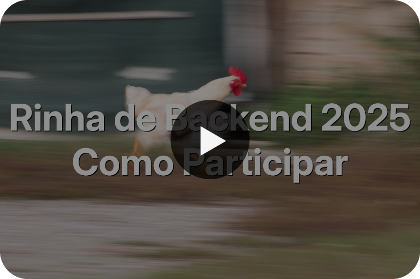

# Rinha de Backend - 2025

A Rinha de Backend é um desafio em que é necessário desenvolver uma solução backend em qualquer tecnologia e tem como principal objetivo o aprendizado e compartilhamento de conhecimento! Esta é a terceira edição do desafio.

**Importante!**: A data limite para submeter seu backend é **2025-08-17 até as 23:59:59**! A previsão para a divulgação dos resultados é para o dia **2025-08-20**.

A Rinha já está rolando. Acompanhe a prévia dos resultados [aqui](./PREVIA_RESULTADOS.md) ou por este [fantástico site](https://rinhers.kauefraga.dev/) gentilmente desenvolvido pelo [Kauê Fraga](https://kauefraga.dev/), ou [este site](https://rinha2025.andersongomes.dev.br/) focado no ranking desenvolvido por [Anderson Gomes](https://andersongomes.dev.br/).

Se quiser saber mais sobre o espírito da Rinha de Backend, confira os repositórios da [primeira](https://github.com/zanfranceschi/rinha-de-backend-2023-q3) e [segunda](https://github.com/zanfranceschi/rinha-de-backend-2024-q1) edições, [assista a alguns vídeos](https://www.youtube.com/results?search_query=rinha+de+backend), ou [procure na internet](https://www.google.com/search?q=rinha+de+backend) sobre ela – você vai encontrar bastante coisa!

#### Rinha nas redes sociais

[@rinhadebackend](https://x.com/rinhadebackend) no X
[@rinhadebackend.bsky.social](https://bsky.app/profile/rinhadebackend.bsky.social) no Bluesky
[zan](https://www.linkedin.com/in/francisco-zanfranceschi/) no LinkedIn (criador da rinha)

## O Desafio
Nessa terceira edição da Rinha de Backend o desafio é intermediar solicitações de pagamentos para dois serviços de processamento de pagamentos com a menor taxa. O plot twist é que esses serviços irão sofrer instabilidades e você precisa desenvolver a melhor estratégia para que o máximo de pagamentos sejam processados!

**[Instruções detalhadas sobre o desafio](INSTRUCOES.md)**

Você também pode assistir a [esse vídeo](https://www.youtube.com/watch?v=ldPkTtkJ86k) no YouTube sobre as instruções para participar da Rinha.

## Pontos em Aberto

O seguinte são questões ainda não foram endereçados ou são pontos em aberto:
- Automação decente da execução dos testes
- Script final do teste

*Por favor, contribua com esse evento revisando textos, reportando problemas, bugs e inconsistências, dando sugestões e divulgando. Faça parte dessa comunidade!*