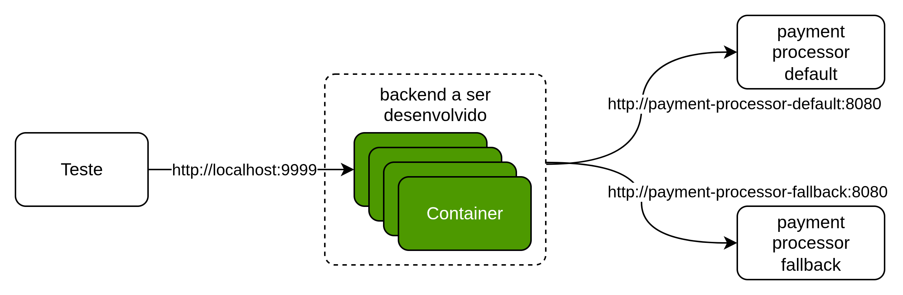
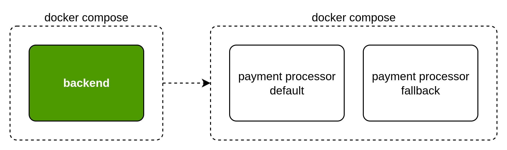

# Rinha de Backend - 2025

A Rinha de Backend é um desafio em que é necessário desenvolver uma solução backend em qualquer tecnologia e tem como principal objetivo o aprendizado e compartilhamento de conhecimento! Esta é a terceira edição do desafio. A data limite para enviar sua submissão ainda não foi definida.


Se quiser saber mais sobre o espírito da Rinha de Backend, confira os repositórios da [primeira](https://github.com/zanfranceschi/rinha-de-backend-2023-q3) e [segunda](https://github.com/zanfranceschi/rinha-de-backend-2024-q1) edições, [assista a alguns vídeos](https://www.youtube.com/results?search_query=rinha+de+backend), ou [procure na internet](https://www.google.com/search?q=rinha+de+backend) sobre ela – você vai encontrar bastante coisa!

#### Rinha nas redes sociais

[@rinhadebackend](https://x.com/rinhadebackend)  no X
[@rinhadebackend.bsky.social](https://bsky.app/profile/rinhadebackend.bsky.social) no Bluesky
[zan](https://www.linkedin.com/in/francisco-zanfranceschi/) no LinkedIn (criador da rinha)


## O Desafio
Nessa terceira edição da Rinha de Backend, o desafio é intermediar (integrar) requisições de pagamentos para serviços de processamento de pagamentos (chamado aqui de **Payment Processor**) com a menor taxa financeira por transação. Haverá dois serviços Payment Processor: o **default** – com a taxa mais baixa – e o **fallback** que contém a taxa mais alta e deveria ser usado apenas quando o serviço default não estiver disponível.

*O código fonte do **Payment Processor** está disponível [aqui](https://github.com/zanfranceschi/rinha-de-backend-2025-payment-processor).*


Durante o teste, os dois serviços irão sofrer instabilidades esporádicas (surpresas) nos endpoints responsáveis por receber as requisições de processamento de pagamentos. Há dois tipos de instabilidade:
1. Tempos de resposta aumentados: o endpoint de pagamentos demora a responder – desde muito a apenas um pouco lento.
1. Serviço indisponível: o endpoint retorna um erro de servidor HTTP 5XX e não processa pagamentos. 

Caberá a você desenvolver a melhor estratégia para processar pagamentos que seja a mais rápido possível e com a menor taxa – esse é o objetivo principal dessa edição da Rinha. Por favor, note que é possível enviar as requisições de pagamento de forma assíncrona. Porém, quanto mais rápido você enviar os pagamentos para um Payment Processor, maior chance terá de ir bem na pontuação porque ao final do teste haverá uma contagem de quantos pagamentos foram processados. Você obterá menos pontos se houver muitos pagamentos ainda não enviados aos serviços Payment Processor ao final do teste. Obviamente, você também pode fazer a integração de forma síncrona. Como dito anteriormente, caberá a você desenvolver uma estratégia.


Para facilitar a verificação da disponibilidade dos serviços, para cada serviço, é fornecido um endpoint de **health-check** que mostra se o serviço está enfrentando falhas e qual é o tempo mínimo de resposta para o processamento de pagamentos. Entretanto, este endpoint possui um limite de uma chamada para cada cinco segundos. Caso este limite seja ultrapassado, uma resposta `HTTP 429 - Too Many Requests` será retornada. Use-o com sabedoria!

Os dois serviços Payment Processor são idênticos em termos de endpoints – a única diferença realmente é a taxa. Novamente, quanto mais requisições de processamento de pagamentos forem enviadas para o serviço **default**, menos taxa você pagará e isso será melhor para a pontuação na Rinha.

## Como Participar

Pessoas de todos os níveis costumam participar da Rinha de Backend – desde iniciantes até pessoas bastante experientes. O mais importante da Rinha é o espírito de cooperação entre os participantes e aprendizado. Entretanto, é recomendado que você tenha conhecimento em alguma linguagem de programação, docker, e git – pelo menos o básico. Ah, e pode participar em dupla de dois, dupla de três, dupla de 15, individualmente, etc. O importante é participar!

As seções seguintes mostram como participar da Rinha.

### Desenvolver um backend com uma API HTTP

Você precisará criar um API com os seguintes endpoints.

#### Payments
Principal endpoint que recebe requisições de pagamentos a serem processados.
```
POST /payments
{
    "correlationId": "4a7901b8-7d26-4d9d-aa19-4dc1c7cf60b3",
    "amount": 19.90
}

HTTP 2XX
Qualquer coisa
```
**requisição**
- `correlationId` é um campo obrigatório e único do tipo UUID.
- `amount` é um campo obrigatório do tipo decimal.

**resposta**
- Qualquer resposta na faixa 2XX (200, 201, 202, etc) é válida. O corpo da resposta não será validado – pode ser qualquer coisa ou até vazio.

#### Payments Summary
Este endpoint precisa retornar um resumo do que já foi processado em termos de pagamentos.
```
GET /payments-summary?from=2020-07-10T12:34:56.000Z&to=2020-07-10T12:35:56.000Z

HTTP 200 - Ok
{
    "default" : {
        "totalRequests": 43236,
        "totalAmount": 415542345.98
    },
    "fallback" : {
        "totalRequests": 423545,
        "totalAmount": 329347.34
    }
}
```
**requisição**
- `from` é um campo opcional de timestamp no formato ISO em UTC (geralmente 3 horas a frente do horário do Brasil).
- `to` é um campo opcional de timestamp no formato ISO em UTC.

**resposta**
- `default.totalRequests` é um campo obrigatório do tipo inteiro.
- `default.totalAmount` é um campo obrigatório do tipo decimal.
- `fallback.totalRequests` é um campo obrigatório do tipo inteiro.
- `fallback.totalAmount` é um campo obrigatório do tipo decimal.

**Importante!**
Este endpoint, em conjunto com **Payments Summary** dos Payment Processors, serão chamados algumas vezes durante o teste para verificação de consistência. Os valores precisam estar consistentes, caso contrário, haverá penalização por inconsistência. 


#### Integrar seu Backend com os dois Processadores de Pagamento

Seu backend deverá se integrar com dois Processadores de Pagamento. Os dois serviços possuem API idênticas, então as descrições seguintes servem para os dois.

#### Payments
Este endpoint recebe e computa um pagamento – ele é similar ao endpoint **Payments** que seu backend precisa disponibilizar. É o principal endpoint para você integrar com seu backend.
```
POST /payments
{
    "correlationId": "4a7901b8-7d26-4d9d-aa19-4dc1c7cf60b3",
    "amount": 19.90,
    "requestedAt" : "2025-07-15T12:34:56.000Z"
}

HTTP 200 - Ok
{
    "message": "payment processed successfully"
}
```
**requisição**
- `correlationId` é um campo obrigatório e único do tipo UUID.
- `amount` é um campo obrigatório do tipo decimal.
- `requestedAt` é um campo obrigatório do tipo timestamp no formato ISO em UTC.

**resposta**
- `message` é campo sempre presente do tipo texto.

#### Health-Check
Neste endpoint é possível verificar as condições do endpoint **Payments**. Este endpoint nos dois serviços de Payment Processor pode lhe ajudar a decidir qual é a melhor opção para processar um pagamento.

```
GET /payments/service-health

HTTP 200 - Ok
{
    "failing": false,
    "minResponseTime": 100
}
```
**requisição**
    - Não há parâmetros para requisição. Entretanto, este endpoint impõe um limite de chamadas – 1 chamada a cada 5 segundos. Se este limite for ultrapassado, você receberá uma resposta de erro do tipo HTTP 429 - Too Many Requests.

**resposta**
- `failing` é um campo sempre presente do tipo booleano que indica se o endpoint **Payments** está disponível. Se não estiver, significa que requisições para o endpoint receberão erros `HTTP5XX`.
- `minResponseTime` é um campo sempre presente do tipo inteiro indicando o melhor tempo de resposta possível para o endpoint **Payments**. Por exemplo, se o valor retornado for `100`, não haverá respostas mais rápidas do que 100ms.


#### Payment Details
Você não precisa se integrar com este endpoint. Ele serve para troubleshooting, caso queira/precise.
```
GET /payments/{id}

HTTP 200 - Ok
{
    "correlationId": "4a7901b8-7d26-4d9d-aa19-4dc1c7cf60b3",
    "amount": 19.90,
    "requestedAt" : 2025-07-15T12:34:56.000Z
}
```
**requisição**
    - `{id}` é um parâmetro obrigatório do tipo UUID.

**resposta**
- `correlationId` é um campo sempre presente do tipo UUID.
- `amount` é um campo sempre presente do tipo decimal.
- `requestedAt` é um campo sempre presente do tipo timestamp no formato ISO em UTC.

#### Endpoints Administrativos de Payment Processor
Os serviços Payment Processor contam com endpoints administrativos. Estes endpoints serão usados durante o teste PELO SCRIPT TESTE e você não deve se integrar com eles na versão final. Entretanto, eles podem ser úteis para simular falhas, tempos demorados de resposta, verificar consistência, etc. Todos os endpoints a seguir exigem um token que deve ser informado no cabeçalho `X-Rinha-Token` na requisição.

#### Payments Summary
Este endpoint é similar ao endpoint **Payments Summary** que você precisa desenvolver em seu backend.
```
GET /admin/payments-summary?from=2020-07-10T12:34:56.000Z&to=2020-07-10T12:35:56.000Z

HTTP 200 - Ok
{
    "totalRequests": 43236,
    "totalAmount": 415542345.98,
    "totalFee": 415542.98,
    "feePerTransaction": 0.01
}
```
**requisição**
- `from` é um campo opcional de timestamp no formato ISO em UTC.
- `to` é um campo opcional de timestamp no formato ISO em UTC.

**resposta**
- `totalRequests` é um campo sempre presente do tipo numérico inteiro. Ele mostra quantos pagamentos foram processados no período selecionado ou todos pagamentos se o período não for informado.
- `totalAmount` é um campo sempre presente do tipo decimal. Ele mostra a soma de todos os pagamentos processados no período selecionado ou a soma de todos pagamentos se o período não for informado
- `totalFee` é um campo sempre presente do tipo decimal. Ele mostra a soma das taxas dos pagamentos processados no período selecionado ou a soma das taxas dos pagamentos se o período não for informado
- `feePerTransaction` é um campo sempre presente do tipo decimal. Ele mostra qual o valor da taxa por transação.

**Importante!**
Este endpoint, em conjunto com **Payments Summary** que seu backend precisa disponibilizar, serão chamados algumas vezes durante o teste para verificação de consistência. Os valores precisam estar consistentes, caso contrário, haverá penalização por inconsistência. 

#### Set Token
Este endpoint configura uma senha para os endpoints administrativos. Se você alterar a senha em sua submissão final, o teste será abortado e você ficará sem pontuação na Rinha. A senha inicial é `123` e você pode usá-la para fazer testes locais.
```
PUT /admin/configurations/token
{
    "token" : "uma senha qualquer"
}

HTTP 204 - No Content
```
**requisição**
- `token` é um campo obrigatório do tipo texto.

**resposta**
- N/A

#### Set Delay
Este endpoint configura um atraso proposital no endpoint **Payments** para simular um tempo mais de resposta.
```
PUT /admin/configurations/delay
{
    "delay" : 235
}

HTTP 204 - No Content
```
**requisição**
- `delay` é um campo obrigatório do tipo inteiro para definir os milisegundos de atraso no tempo de resposta no endpoint **Payments**.

**resposta**
- N/A

#### Set Failure
Este endpoint configura uma falha proposital no endpoint **Payments** para simular erros de servidor.
```
PUT /admin/configurations/failure
{
    "failure" : true
}

HTTP 204 - No Content
```
**requisição**
- `failure` é um campo obrigatório do tipo booleano para definir se o endpoint **Payments** irá retornar uma falha.

**resposta**
- N/A

#### Database Purge
Este endpoint exclui todos os pagamentos do banco de dados e serve apenas para facilitar o desenvolvimento.
```
POST /admin/purge-payments

HTTP 200 - Ok
{
    "message": "All payments purged."
}
```
**requisição**
- N/A

**resposta**
- `message` é um campo sempre presente do tipo texto.


#### Resumo dos Endpoints

As tabelas abaixo oferem um resumo para facilitar a visão geral da solução.

**Endpoints a serem desenvolvidos**

| Endpoint                          | Descrição       |
| -                                 | -               |
| POST /payments                    | Intermedia a requisição para o processamento dum pagamento. |
| GET /payments-summary             | Exibe detalhes das requisições de processamento de pagamentos. |


**Endpoints disponíveis nos dois serviços Payment Processor**
| Endpoint                          | Descrição       |
| -                                 | -               |
| POST /payments                    | Requisita o processamento de um pagamento. |
| GET /payments/service-health      | Verifica as condições de funcionamento do endpoint de pagamentos. Limite de 1 chamada a cada 5 segundos. |
| GET /payments/{id}                | Exibe detalhes de uma requisição de processamento de pagamento. |
| GET /admin/payments-summary       | Exibe detalhes das requisições de processamento de pagamentos. |
| PUT /admin/configurations/token   | Redefine um token de acesso necessário para todos os endpoints prefixados com '/admin/' |
| PUT /admin/configurations/delay   | Configura o atraso no endpoint de pagamentos. |
| PUT /admin/configurations/failure | Configura falha no endpoint de pagamentos. |
| POST /admin/purge-payments        | Elimina todos os pagamentos da base de dados. Para desenvolvimento apenas. |

## Arquitetura

O diagrama seguinte mostra o desenho em alto nível da solução da Rinha como um todo. O teste irá acessar seu backend através da porta **9999** (você precisa expor seus endpoints nessa porta). E você irá se integrar com os dois Payment Processors através dos endereços `http://payment-processor-default:8080` e `http://payment-processor-fallback:8080`.



A Rinha – em partes – simula sistemas reais em uma escala micro (com diferenças muito importantes como pouca resilência, falta de escalabilidade, foco em performance extrema com pouco consumo de recursos, etc) e a forma mais fácil e barata para tal é o uso de containers integrados com docker compose. Para essa edição, a solução completa (o backend que você desenvolverá e os Payment Processors) irá usar dois docker compose simulando redes diferentes. Você precisará criar o seu arquivo `docker-compose.yml` que irá se conectar a rede do [docker-compose.yml](./payment-processor/docker-compose.yml) dos Payment Processors.



Trecho de definição de redes e serviços do [docker-compose.yml](./payment-processor/docker-compose.yml) dos Payment Processors.
```yaml
# etc...

services:
  payment-processor-1:
    image: zanfranceschi/payment-processor
    networks:
      - payment-processor
    hostname: payment-processor-default
    ports:
      - 8001:8080
    # etc...

    payment-processor-2:
    image: zanfranceschi/payment-processor
    networks:
      - payment-processor
    hostname: payment-processor-fallback
    ports:
      - 8002:8080
    # etc...

networks:
  payment-processor:
    name: payment-processor
    driver: bridge
```

Exemplo de definição de redes e ingresso de um serviço a rede dos Payment Processors do `docker-compose.yml` que você poderá criar.
```yaml
# etc...

services:
  meu-backend:
    image: seu-usuario/meu-backend:latest
    networks:
      - backend
      - payment-processor
    environment:
      - PAYMENT_PROCESSOR_URL_DEFAULT=http://payment-processor-default:8080
      - PAYMENT_PROCESSOR_URL_FALLBACK=http://payment-processor-fallback:8080
    # etc...

networks:
  backend:
    driver: bridge
  payment-processor:
    external: true
```

Dessa forma, os containers que declaram as duas redes poderão acessar os Payment Processors. O uso de variáveis de ambiente é um exemplo de como você poderá referenciar as URLs dos Payment Processors. Note que as entradas DNS do docker são `payment-processor-default` e `payment-processor-fallback` na porta `8080`.

Para integrar, desenvolver e explorar os Payment Processors basta subir o docker compose dos Payment Processors. Você será capaz de acessá-los os dois serviços através do seu host pelos endereços http://localhost:8001 e http://localhost:8002. A URL raiz mostra algumas informações e oferece um link para explorar as APIs como mostra a imagem seguinte.


*****Resumindo****: seus containers deverão se integrar via http://payment-processor-default:8080 e http://payment-processor-fallback:8080 com os Payment Processors (não esqueça de definir a rede externa payment-processor no seu docker-compose.yml) e você também poderá acessá-los pela máquina host através de localhost nas portas 8001 e 8002 (defaul e fallback respectivamente).*

**Nota Importante!**
Após você ter criado seu `docker-compose.yml` com seus serviços, é importante que suba o [docker-compose.yml](./payment-processor/docker-compose.yml) dos Payment Processors antes para que rede `payment-processor` seja criada. Caso contrário, você poderá receber uma mensagem de erro relacionado a redes ao subir seus containers.
```
network payment-processor declared as external, but could not be found
```

**Nota para Mac Users**
Use [docker-compose-arm64.yml](./payment-processor/docker-compose-arm64.yml) se seu processador for arm64.

### Restrições

Nas edições anteriores, havia restrições de tecnologia – por exemplo, apenas alguns bancos poderiam ser usados, load balancers, etc. Nessa edição, as restrições de tecnologia foram afrouxadas – praticamente, qualquer tecnologia pode ser usada. Entretanto, as seguintes restrições* de containers devem ser aplicadas:

- O modo de rede deve ser **bridge** – o modo **host** não é permitido.
- Não é permitido modo **privileged**.
- Não é permitido uso de serviços [replicados](https://docs.docker.com/reference/compose-file/deploy/#replicas) – isso dificulta a verificação dos recursos usados.

<sub><sup>* Qualquer outra restrição poderá ser adicionada ou removida ao decorrer do evento a critério da organização do evento.</sup></sub>

Uma das essências da Rinha de Backend é a restrição de recursos computacionais. Essa restrições devem ser declaradas junto à declaração dos serviços (ou templates) em seu `docker-compose.yml` e não poderão exceder o seguinte* (distribuído da forma que quiser entre todos os serviços):

- 1.5 unidades de CPU
- 350MB de memória

<sub><sup>* Sujeito a mudanças ao decorrer do evento a critério da organização do evento.</sup></sub>

Use a unidade de medida `MB` para declarar restrições de memória.

Exemplo de restrição de recursos.
```yaml
services:
  load-balancer:
    image: nginx:latest
    deploy:
      resources:
        limits:
          cpus: "0.25"
          memory: "15MB"
    # etc...

# etc...
```

#### Restrições da API HTTP
Seu backend precisa ter, no mínimo, duas instâncias de containers que servem os endpoints HTTP – servidores web. Diferentemente das edições anteriores da Rinha, você pode ter mais de duas instâncias de servidores web, mas não menos do que duas.


### Como Enviar Seu Backend

Para ter seu backend testado oficialmente pela Rinha de Backend, ver os resultados em comparação com outras submissões e ter seu nome listado como participantes, você precisará fazer o seguinte:

- Ter um repositório git (github, por exemplo) público com o código fonte e todos os artefatos relacionados a submissão da Rinha.

- Ter suas imagens declaradas no `docker-compose.yml` disponíveis num registro público de imagens (https://hub.docker.com/ por exemplo). As imagens devem ser construídas para plataforma `linux/amd64` – isso é especialmente importante se você desenvolve em Mac ou Windows. Exemplo de como construir uma imagem docker para `linux/amd64`: `docker buildx build --platform linux/amd64 -t your-image-name:tag .`.

- Abrir um PR neste repositório adicionando um diretório com sua identificação em [participantes](participantes/). Neste PR você deverá:
    - Não incluir o código fonte na submissão! Seu código fonte deverá estar em outro repositório público como mencionado anteriormente. 
    - Incluir um `README.md` explicando as tecnologias que usadas e um link para o repositório com o código fonte da sua submissão.
    - Incluir o arquivo `docker-compose.yml` na raiz desse repositório com suas dependências (scripts de banco, configurações, etc.).
    - Incluir um arquivo `info.json` com a seguinte estrutura para facilitar a coleta das tecnologias usadas:
    ```json
    {
        "name": "Débora Nis Zanfranceschi",
        "social": ["https://x.com/debora-zan", "https://bsky.app/profile/debora-zan.bsky.social"],
        "source-code-repo": "https://github.com/debora-zan/rinha-de-backend-2025",
        "langs": ["node"],
        "storages": ["postgresql", "redis"],
        "messaging": ["rabbitmq", "nats"],
        "load-balancers": ["nginx"],
        "other-technologies": ["xpto"] // inclua qq coisa que não se encaixe nas outra categorias
    }
    ```
    - Exemplo de estrutura de arquivos de um PR de submissão:
    ```
    ├─ participantes/
    |  ├─ debs-node-01/
    |  |  ├─ docker-compose.yml
    |  |  ├─ info.json
    |  |  ├─ nginx.config
    |  |  ├─ sql/
    |  |  |  ├─ ddl.sql
    |  |  |  ├─ dml.sql
    |  |  ├─ README.md
    ```

**Não há limite de submissões por pessoa. Nas edições passadas, algumas pessoas enviaram até 4 backends em tecnologias ou arquiteturas diferentes!** Obviamente, cada submissão precisa de uma entrada diferente no diretório `participantes`.

### Como Testar Localmente Seu Backend

A parte mais importante do processo da Rinha de Backend (fora o aprendizado e diversão) é o teste. Por isso, faz todo o sentido que você consiga testar seu backend mais ou menos da mesma forma como no teste oficial. Nas duas últimas edições, foi usada a ferramenta Gatling, mas muita gente pediu e sugeriu o [k6](https://k6.io/) e por isso nessa edição a ferramenta usada será o k6!!!

No diretório [rinha-test](./rinha-test) você encontra os artefatos necessários para testar localmente seu backend. Note que o teste disponibilizado aqui não será exatamente o mesmo usado para os testes oficiais, mas deve ser similar o suficiente para você desenvolver, melhorar e se divertir localmente durante seu processo de desenvolvimento. O arquivo [README.md](./rinha-test/README.md) fornece instruções detalhadas sobre com executar os testes.


É isso! Boa diversão e não deixe de postar sua evolução nas redes sociais da Rinha de Backend (https://x.com/rinhadebackend, https://bsky.app/profile/rinhadebackend.bsky.social e https://www.linkedin.com/in/francisco-zanfranceschi/).

## Pontos em Aberto

O seguinte são questões ainda não foram endereçados ou pontos em aberto:

- Data limite para submissões e resultados
- Repositório para armazenar os resultados (ou manter no mesmo?)
- Definição da pontuação
- Automação da execução dos testes
- Script final do teste
- Formato final do arquivo `info.json` nas submissões

Por favor, contribua com esse evento revisando textos, reportando problemas, bugs e inconsistências, dando sugestões e divulgando. Faça parte dessa comunidade!
