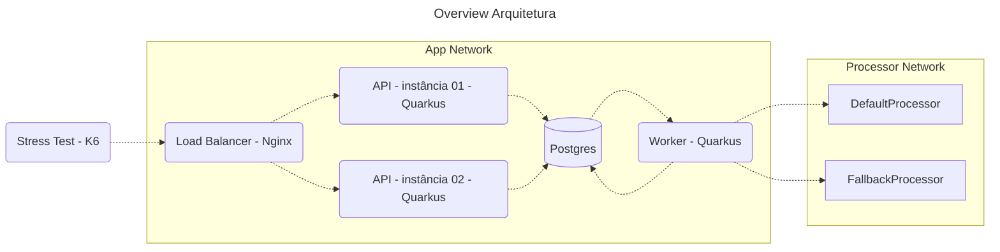

# rinha-de-backend-2025-java-quarkus

Projeto para participar da 🐓[rinha-de-backend-2025](https://github.com/zanfranceschi/rinha-de-backend-2025)

### PGConf Brasil 2022 - Implementando Mensageria com PostgreSQL, por Rafael Ponte

- Quarkus 3.20(current LTS)
- Java 21(current LTS)
- Maven 3

---
# Aprendizangens

