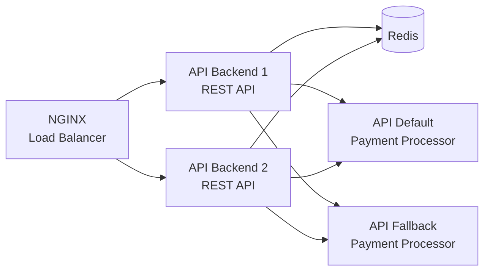
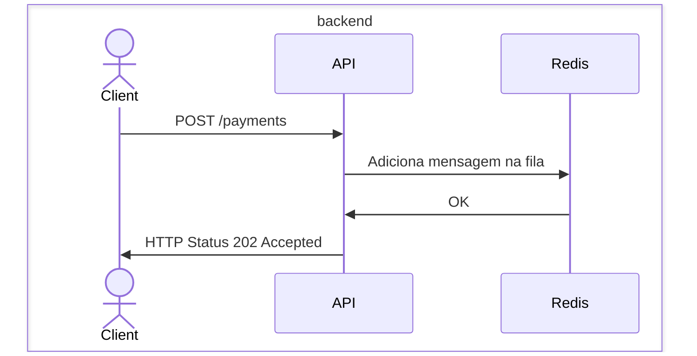
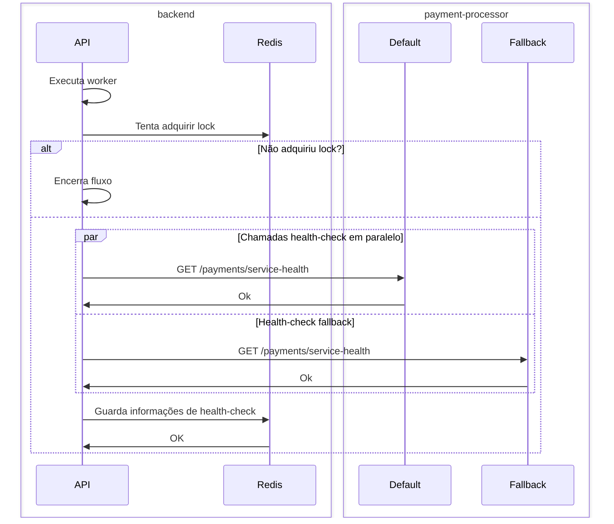
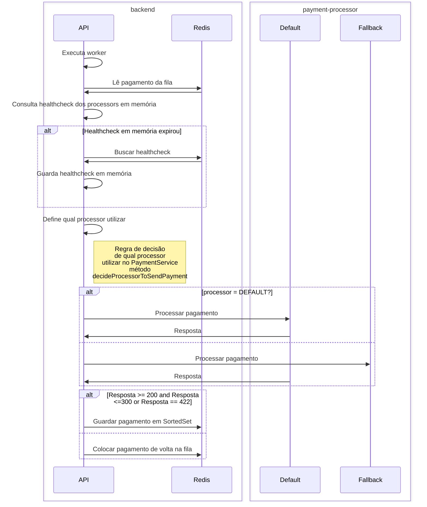

# rinha-backend-2025

Este projeto foi feito para participar da [Rinha de Backend 2025](https://github.com/zanfranceschi/rinha-de-backend-2025) e a minha idéia foi principalmente praticar os frameworks e estilo de programação:
 
- **Java 21** 
- **[Quarkus](https://quarkus.io/)** (Framework Java completo e acredito que o mais famoso depois do Spring. Primeira vez que utilizei, a dev experience é muito boa e quis aproveitar a compilação nativa que é uma de suas principais features para tentar ter uma boa performance e aplicação leve)
- **[Mutiny](https://smallrye.io/smallrye-mutiny/latest/)** (Biblioteca para programação reativa integrada com o Quarkus. Para praticar programação reativa, que estudei há muito tempo mas nunca coloquei em prática, e claro, aproveitar das threads não bloqueantes para tentar uma performance melhor)
- **[Redis](https://redis.io/)** (Sempre utilizei como cache, mas nunca como fila e lock, oportunidade boa)

## Arquitetura

Sobre a arquitetura, inicialmente pensei em utilizar junto com um Postgres para persistir os pagamentos, mas decidi procurar sobre as possibilidades de manter absolutamente tudo no Redis para economizar CPU e RAM na arquitetura, e cheguei ao seguinte:



## Diagramas de sequência

Quero explicar aqui os três fluxos principais da aplicação (fora o endpoint de payments-summary). Os workers são Unis (fluxo de um item do Mutiny) que executa ele mesmo recursivamente quando o processamento de um item é finalizado.

### Endpoint de pagamento



### Worker para verificar a saúde dos payment processors



- Worker para processar os pagamentos



## Pré-requisitos

- Java 21
- Maven 3.6.3 ou maior
- Docker

## Executando a Aplicação

### Em Modo de Desenvolvimento

Você pode executar a aplicação em modo de desenvolvimento:

```bash
./mvnw quarkus:dev
```

### Docker

Pode rodar a aplicação via Docker Compose

```bash
docker-compose up -d
```

### Compilar nativo

Para compilar esta aplicação em um binário nativo, usar o comando:

```bash
./mvnw clean package -Dnative
```

Com isso, serão baixadas as imagens Docker necessárias para compilar o projeto Quarkus nativamente e a compilação será iniciada. Ao final do processo, será gerado um arquivo binário dentro da pasta target, que pode ser rodado: rinha-backend-2025-1.0.0-SNAPSHOT-runner

```bash
./target/rinha-backend-2025-1.0.0-SNAPSHOT-runner
```

### Link do repositório
[Caique Borges - Rinha Backend 2025 Quarkus](https://github.com/caiquetgr/rinha_backend_2025_quarkus)