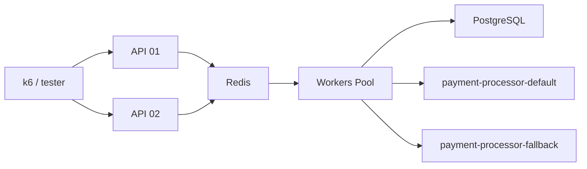

# Rinha de Backend 2025 – Backend em Go

[](https://github.com/d4vz/golang-rinha-backend-2025)


## Visão Geral

Este repositório contém a solução em **Go** para a terceira edição da **Rinha de Backend (2025)**. O objetivo é intermediar pagamentos para dois serviços de _Payment Processor_ (**default** e **fallback**) maximizando throughput e minimizando custos (quantidade de transações enviadas para o fallback).

A aplicação foi desenhada para ser **leve**, **resiliente** e **escalável** dentro das restrições do desafio (1,5 CPU / 350 MB):

- 2 instâncias _stateless_ da API escritas com [Fiber](https://github.com/gofiber/fiber).
- Fila persistente em **Redis** (LPUSH/RPOP) garantindo _at-least-once_ delivery.
- **Worker pool** assíncrono que faz _back-pressure_ e despacha pagamentos em paralelo.
- **Nginx** faz balanceamento de carga na porta `9999` (obrigatório pelo desafio).
- **PostgreSQL** armazena os pagamentos efetivamente processados, permitindo consultas de resumo consistentes.
- **Circuit-Breaker** (`sony/gobreaker`) previne _thundering-herd_ nos processadores em falha.



---

## Endpoints Expostos

| Método | Rota                | Descrição                                                                         |
| ------ | ------------------- | --------------------------------------------------------------------------------- |
| POST   | `/payments`         | Recebe pagamento `{correlationId, amount}` e o coloca na fila para processamento. |
| GET    | `/payments-summary` | Retorna resumo agregado por processador `?from&to` (ISO-8601).                    |
| POST   | `/purge-payments`   | **DEV only** – limpa a tabela de pagamentos.                                      |

Todas as requisições devem ser feitas via porta **9999** (balanceadas pelo Nginx).

---

## Estrutura do Projeto

```
.
├─ cmd/api            # bootstrap HTTP
├─ handler            # controllers Fiber
├─ payment            # domínio + service layer
├─ worker             # worker pool / consumers
├─ pkg/store          # Postgres & Redis clients
├─ config             # variáveis de ambiente helpers
├─ docker-compose.yml # stack completa + limites de recursos
└─ Dockerfile         # build otimizado multi-stage
```

---

## Como Rodar Localmente

1. **Clone** o repositório e **suba** os _Payment Processors_ (rede externa):
   ```bash
   git clone https://github.com/zanfranceschi/rinha-de-backend-2025-payment-processor.git && \
   cd rinha-de-backend-2025-payment-processor && docker compose up -d
   ```
2. **Suba** esta stack:
   ```bash
   cd ../golang-rinha-backend-2025
   docker compose up --build -d
   ```
3. Teste a aplicação:

   ```bash
   curl -X POST http://localhost:9999/payments \
        -H 'Content-Type: application/json' \
        -d '{"correlationId":"4a7901b8-7d26-4d9d-aa19-4dc1c7cf60b3","amount":19.90}'

   curl "http://localhost:9999/payments-summary?from=2024-01-01T00:00:00Z&to=2025-01-01T00:00:00Z"
   ```

### Variáveis de Ambiente Principais

| Variável                    | Default                                  | Descrição              |
| --------------------------- | ---------------------------------------- | ---------------------- |
| `DB_HOST`                   | `db`                                     | Host Postgres          |
| `DB_PORT`                   | `5432`                                   | Porta Postgres         |
| `DB_USER` / `DB_PASSWORD`   | `rinha`                                  | Credenciais            |
| `DB_NAME`                   | `rinha`                                  | Banco                  |
| `REDIS_HOST` / `REDIS_PORT` | `cache` / `6379`                         | Endereço Redis         |
| `PROCESSOR_DEFAULT_URL`     | `http://payment-processor-default:8080`  | URL processor default  |
| `PROCESSOR_FALLBACK_URL`    | `http://payment-processor-fallback:8080` | URL processor fallback |

---

## Teste Local com k6

O repositório oficial da Rinha fornece um diretório `rinha-test` com _scripts_ k6.

```bash
cd rinha-test
k6 run -e BASE_URL=http://localhost:9999 main.js
```

---

## Build da Imagem para `linux/amd64`

```bash
docker buildx build --platform linux/amd64 -t <user>/rinha-go-backend:latest .
```

---

## Próximos Passos & Melhorias

- Implementar **health-check adaptativo** consumindo `/payments/service-health` para decidir dinamicamente entre default e fallback.
- Persistir estado do circuit-breaker em Redis para manter contagem entre múltiplas instâncias.
- Adicionar métricas **Prometheus / OpenTelemetry** para visibilidade de fila, latência e throughput.

---

## Licença

Projeto distribuído sob a licença MIT. Sinta-se livre para clonar, melhorar e enviar PRs!
