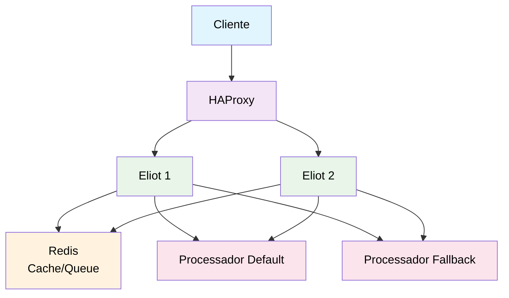

# Eliot

Um serviço de proxy de pagamentos de alta performance escrito em Go, desenvolvido para a Rinha de Backend 2025. O Eliot atua como um intermediário entre clientes e processadores de pagamento, fornecendo recursos de hedging, failover automático e agregação de dados em tempo real.

## 🚀 Características

- **Alta Performance**: Construído com FastHTTP para máxima velocidade e baixa latência
- **Hedging**: Estratégia de hedge para reduzir latência com requisições paralelas
- **Failover Automático**: Detecção de saúde dos processadores e alternância automática
- **Deduplicação**: Prevenção de pagamentos duplicados usando Redis
- **Processamento Assíncrono**: Sistema de filas com Redis Streams para alta throughput
- **Load Balancing**: HAProxy para distribuição de carga entre instâncias
- **Agregação em Tempo Real**: Sumarização de dados por minuto para relatórios rápidos

## 🏗️ Arquitetura



### Componentes Principais

- **HTTP Server**: API REST com endpoints `/payments` e `/payments-summary`
- **Payment Forwarder**: Encaminha pagamentos para processadores externos
- **Health Checker**: Monitora saúde dos processadores
- **Worker Pool**: Processa pagamentos de forma assíncrona
- **Redis Store**: Cache, deduplicação e agregação de dados

## 📋 API Endpoints

### POST /payments

Cria um novo pagamento (processamento assíncrono).

**Request:**

```json
{
  "correlationId": "550e8400-e29b-41d4-a716-446655440000",
  "amount": 100.50
}
```

**Response:**

- `202 Accepted`: Pagamento enfileirado
- `400 Bad Request`: Dados inválidos
- `200 OK`: Pagamento duplicado (ignorado)

### GET /payments-summary

Retorna sumarização de pagamentos processados.

**Query Parameters:**

- `from` (opcional): Data/hora inicial (RFC3339)
- `to` (opcional): Data/hora final (RFC3339)

**Response:**

```json
{
  "default": {
    "totalRequests": 1500,
    "totalAmount": 45000.75
  },
  "fallback": {
    "totalRequests": 50,
    "totalAmount": 1200.25
  }
}
```

## 🛠️ Configuração

### Variáveis de Ambiente

| Variável | Padrão | Descrição |
|----------|---------|-----------|
| `HTTP_ADDR` | `:8080` | Endereço do servidor HTTP |
| `REDIS_ADDR` | `redis:6379` | Endereço do Redis |
| `REDIS_POOL` | `150` | Tamanho do pool de conexões Redis |
| `PROCESSOR_DEFAULT_URL` | `http://payment-processor-default:8080` | URL do processador principal |
| `PROCESSOR_FALLBACK_URL` | `http://payment-processor-fallback:8080` | URL do processador de backup |
| `TIMEOUT_MS` | `120` | Timeout para requisições (ms) |
| `HEDGE_MS` | `40` | Tempo para iniciar hedge (ms) |
| `WORKER_CONCURRENCY` | `8` | Número de workers concorrentes |

## 🐳 Execução com Docker

### Desenvolvimento Local

```bash
# Construir a imagem
docker build -t fabianoflorentino/eliot:v0.0.1 .

# Executar com docker-compose
docker-compose up -d
```

### Estrutura do Docker Compose

- **HAProxy**: Load balancer na porta 9999
- **Eliot (2 instâncias)**: Servidores de aplicação
- **Redis**: Cache e sistema de filas

## 🧪 Testes de Performance

O projeto inclui scripts K6 para testes de carga:

```bash
# Executar testes de performance
cd k6
k6 run requests.js
```

## 🔧 Desenvolvimento

### Requisitos

- Go 1.24+
- Redis 7+
- Docker & Docker Compose

### Build Local

```bash
# Instalar dependências
go mod download

# Executar aplicação
go run cmd/eliot/main.go

# Build otimizado
CGO_ENABLED=0 GOOS=linux go build -ldflags="-s -w" -o eliot ./cmd/eliot
```

### Estrutura do Projeto

```text
├── cmd/eliot/           # Ponto de entrada da aplicação
├── internal/
│   ├── core/           # Tipos e lógica de domínio
│   ├── health/         # Health checks dos processadores
│   ├── http/           # Servidor HTTP e handlers
│   ├── payments/       # Cliente para processadores
│   ├── queue/          # Sistema de filas Redis
│   ├── storage/        # Camada de persistência Redis
│   └── worker/         # Pool de workers assíncronos
├── k6/                 # Scripts de teste de performance
├── docker-compose.yml  # Orquestração de containers
├── Dockerfile          # Imagem da aplicação
└── haproxy.cfg        # Configuração do load balancer
```

## 📊 Monitoramento

### Health Checks

- Verificação automática de saúde dos processadores
- Cache distribuído de status com TTL de 5 segundos
- Failover automático baseado no status de saúde

### Métricas

- Agregação por minuto para consultas rápidas
- Totais globais para relatórios gerais
- Dados armazenados no Redis com expiração automática

## 🎯 Otimizações Implementadas

1. **FastHTTP**: Servidor HTTP de alta performance
2. **Connection Pooling**: Pool de conexões otimizado para Redis
3. **Hedging Strategy**: Requisições paralelas para reduzir latência
4. **Async Processing**: Processamento assíncrono para alta throughput
5. **Memory Optimization**: Configurações otimizadas de buffer e timeout
6. **Load Balancing**: Distribuição inteligente de carga

## 📄 Licença

Este projeto foi desenvolvido para a Rinha de Backend 2025.

## 👨‍💻 Autor

### Fabiano Florentino

- GitHub: [@fabianoflorentino](https://github.com/fabianoflorentino)
