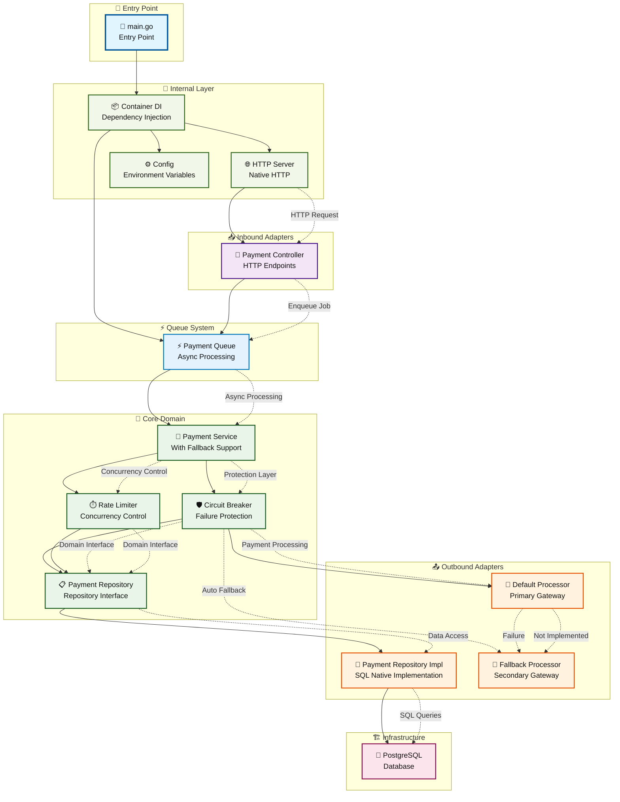
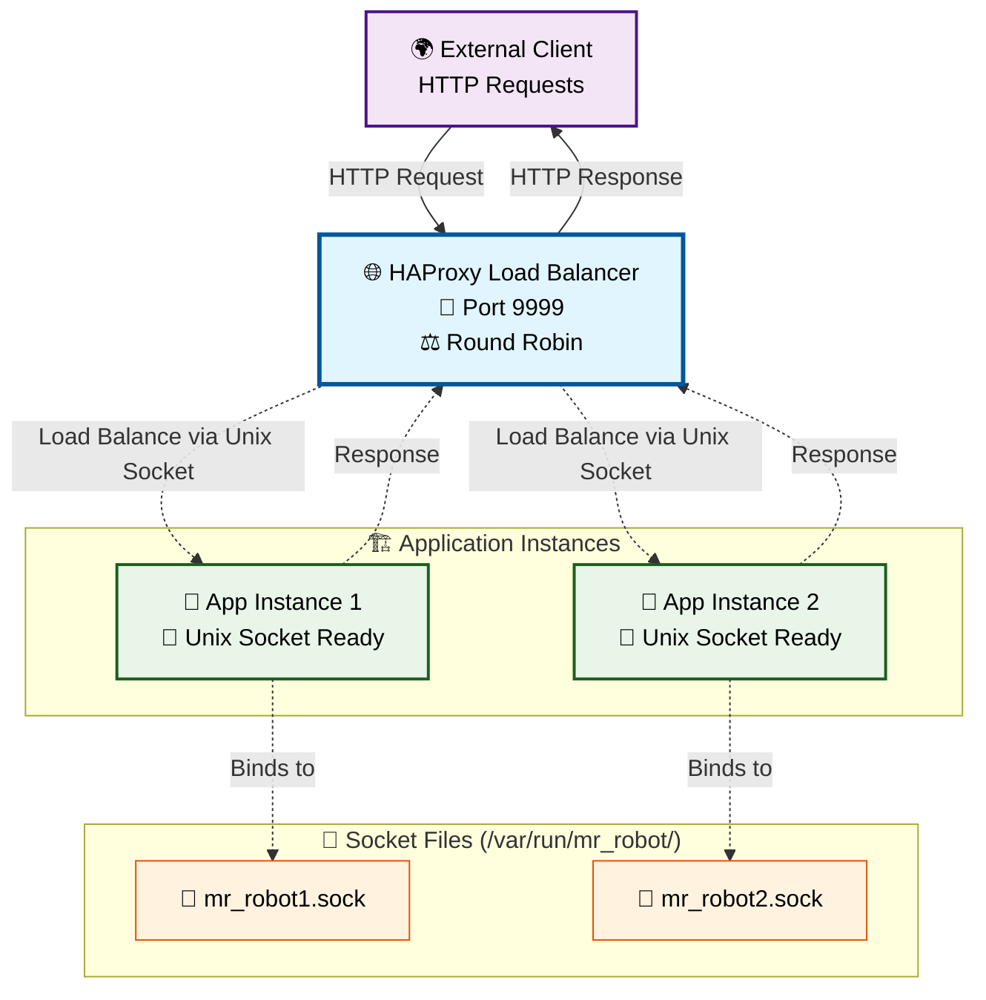

# Mr Robot


Uma API backend desenvolvida em Go para processamento de pagamentos, implementando uma arquitetura hexagonal (ports and adapters) com padrões de Clean Architecture.

## 📋 Sobre o Projeto

O Mr Robot é uma API REST para processamento de pagamentos que implementa:

- **Arquitetura Hexagonal**: Separação clara entre domínio, adaptadores e infraestrutura
- **Clean Architecture**: Inversão de dependências e isolamento do domínio
- **Processamento com Fallback**: Sistema de processamento principal com fallback automático
- **Queue System**: Sistema de filas para processamento assíncrono
- **PostgreSQL**: Persistência robusta com SQL nativo
- **Docker**: Ambiente containerizado para desenvolvimento e produção

### Tecnologias Utilizadas

- **Go 1.24.5**: Linguagem principal
- **HTTP nativo**: Servidor HTTP usando net/http padrão do Go
- **PostgreSQL + pgx**: Driver PostgreSQL nativo com suporte a transações
- **PostgreSQL 17**: Banco de dados relacional
- **Docker & Docker Compose**: Containerização para desenvolvimento e produção
- **Air**: Hot reload para desenvolvimento
- **UUID**: Geração de identificadores únicos para correlação de pagamentos

## 🏗️ Arquitetura

A aplicação segue os princípios da arquitetura hexagonal, organizando o código em camadas bem definidas:

- **`cmd/`**: Ponto de entrada da aplicação
- **`core/`**: Domínio e regras de negócio (entities, services, repositories interfaces)
- **`adapters/inbound/`**: Adaptadores de entrada (controllers HTTP)
- **`adapters/outbound/`**: Adaptadores de saída (repositórios, gateways externos)
- **`internal/`**: Configurações internas da aplicação (container DI, servidor HTTP, filas)
- **`config/`**: Configurações e variáveis de ambiente
- **`database/`**: Configuração do banco de dados

### 📚 Documentação da Arquitetura

Para desenvolvedores que irão realizar manutenção na aplicação, consulte:

#### 📖 **Guias Específicos por Diretório**

| Diretório | Responsabilidade | Documentação | Status |
|-----------|------------------|--------------|---------|
| **`internal/app/`** | Dependency Injection Container | [APP_ARCHITECTURE.md](docs/APP_ARCHITECTURE.md) | ✅ |
| **`core/`** | Domínio e Regras de Negócio | [CORE_ARCHITECTURE.md](docs/CORE_ARCHITECTURE.md) | ✅ |
| **`adapters/`** | Ports and Adapters (Hexagonal) | [ADAPTERS_ARCHITECTURE.md](docs/ADAPTERS_ARCHITECTURE.md) | ✅ |
| **`config/`** | Gerenciamento de Configurações | [CONFIG_ARCHITECTURE.md](docs/CONFIG_ARCHITECTURE.md) | ✅ |
| **`database/`** | Infraestrutura de Dados | [DATABASE_ARCHITECTURE.md](docs/DATABASE_ARCHITECTURE.md) | ✅ |

#### 🗂️ **Documentação Geral**

- **[📚 Guia Completo de Arquitetura](docs/ARCHITECTURE_GUIDE.md)**: Índice principal com visão geral de toda a arquitetura
- **[🔄 Sistema de Fallback](docs/FALLBACK_SYSTEM.md)**: Documentação detalhada do sistema de fallback implementado
- **[🗄️ Migrações SQL](docs/SQL_MIGRATIONS.md)**: Guia de migrações de banco de dados
- **[⚖️ Setup HAProxy](docs/HAPROXY_SETUP.md)**: Configuração do balanceador de carga

#### 🎯 **Para Novos Desenvolvedores**

**Ordem de leitura recomendada:**

1. [📚 ARCHITECTURE_GUIDE.md](docs/ARCHITECTURE_GUIDE.md) - Visão geral completa
2. [🏗️ APP_ARCHITECTURE.md](docs/APP_ARCHITECTURE.md) - Container DI e configurações
3. [🏛️ CORE_ARCHITECTURE.md](docs/CORE_ARCHITECTURE.md) - Domínio e regras de negócio
4. [🔌 ADAPTERS_ARCHITECTURE.md](docs/ADAPTERS_ARCHITECTURE.md) - Entrada e saída de dados

## 🔄 Architecture Flowchart



### 📝 Flowchart Legend

- **🚀 Entry Point**: Application entry point (main.go)
- **🔧 Internal Layer**: Internal configurations, DI Container and application infrastructure
- **📥 Inbound Adapters**: Input adapters (HTTP Controllers)
- **⚡ Queue System**: Queue system for asynchronous processing with workers
- **💚 Core Domain**: Domain layer with business rules and protections (Circuit Breaker/Rate Limiter)
- **📤 Outbound Adapters**: Output adapters (Repositories and external Gateways)
- **🏗️ Infrastructure**: External infrastructure (PostgreSQL)

### 🔀 Payment Processing Flow

1. **HTTP Request** arrives at the `Payment Controller`
2. **Controller** sends job to the `Payment Queue` (asynchronous processing)
3. **Payment Queue** processes jobs using workers and calls the `Payment Service with Fallback`
4. **Payment Service** applies protections (`Circuit Breaker` and `Rate Limiter`)
5. **Service** tries to process payment via `Default Processor` first
6. **If Default fails**, automatically tries the `Fallback Processor`
7. **Service** uses the `Payment Repository` to persist data in PostgreSQL with the processor name used
8. **Data** is saved with automatic retry via SQL transactions and includes which processor was successful

**✅ Fallback Flow**: Default Processor → (on failure) → Fallback Processor → (on success) → Database

### ✅ **Status da Implementação Atualizado**

- ✅ **Implementado**: Queue System com workers, Circuit Breaker, Rate Limiter
- ✅ **Implementado**: Default Processor e Fallback Processor totalmente funcionais
- ✅ **Implementado**: Sistema de fallback automático integrado no Payment Service
- ✅ **Implementado**: Interfaces comum para permitir flexibilidade entre services
- ✅ **Implementado**: Unix Sockets para comunicação HAProxy ↔ App
- ✅ **Funcional**: Processamento assíncrono, retry com backoff exponencial, controle de concorrência
- ✅ **Funcional**: Fallback automático quando o processador padrão falha
- ✅ **Funcional**: Tracking de qual processador foi usado para cada pagamento
- ✅ **Funcional**: Ambos processadores (Default e Fallback) são URLs configuráveis
- ✅ **Funcional**: Circuit Breakers independentes para cada processador
- ✅ **Funcional**: Sistema de purge para limpeza de dados (desenvolvimento/testes)

### 🔧 **Configuração dos Processadores**

Agora você pode configurar ambos os processadores através de variáveis de ambiente:

```bash
# Processador principal
DEFAULT_PROCESSOR_URL=http://payment-processor-default:8080/payments

# Processador de fallback
FALLBACK_PROCESSOR_URL=http://payment-processor-fallback:8080/payments
```

**Comportamento**: O sistema tentará primeiro o `DEFAULT_PROCESSOR_URL`. Se falhar, automaticamente tentará o `FALLBACK_PROCESSOR_URL`. O banco registrará qual processador foi usado com sucesso.

## 🔄 Sistema de Fallback Implementado

### Como Funciona o Fallback

O sistema implementa um fallback automático robusto:

1. **Tentativa Primária**: Toda requisição de pagamento é primeiro enviada para o `Default Processor`
2. **Detecção de Falha**: Se o processador padrão falhar (timeout, erro HTTP, ou resposta de falha), o sistema detecta automaticamente
3. **Fallback Automático**: O sistema imediatamente tenta processar o mesmo pagamento usando o `Fallback Processor`
4. **Persistência Inteligente**: O banco de dados registra qual processador foi usado com sucesso
5. **Proteções Mantidas**: Circuit Breaker e Rate Limiter aplicados a ambos os processadores

### Vantagens da Implementação

- **🔒 Confiabilidade**: Se um processador falhar, o outro assume automaticamente
- **📊 Transparência**: Relatórios mostram exatamente quantos pagamentos usaram cada processador
- **⚡ Performance**: Fallback é imediato, sem delay adicional significativo
- **🛡️ Proteção**: Circuit Breaker previne flood em processadores com problemas
- **🔧 Configurabilidade**: Ambas URLs são configuráveis independentemente

### Monitoramento do Fallback

Use o endpoint `/payment-summary` para monitorar o uso dos processadores:

```bash
curl http://localhost:8888/payment-summary
```

Se você vir valores significativos em `fallback.totalRequests`, isso indica que o processador padrão teve problemas e o sistema de fallback foi ativado com sucesso.

📚 **Para mais detalhes sobre o sistema de fallback, consulte: [`docs/FALLBACK_SYSTEM.md`](docs/FALLBACK_SYSTEM.md)**

## 🔌 Comunicação via Unix Sockets

### Overview

A aplicação Mr. Robot foi configurada para usar **Unix sockets** para comunicação entre o HAProxy (load balancer) e as instâncias da aplicação Go. Esta implementação oferece melhor performance e segurança em comparação com conexões TCP tradicionais.

### Arquitetura de Unix Sockets



### Configuração dos Unix Sockets

#### Variáveis de Ambiente

```bash
# Habilitar Unix sockets
USE_UNIX_SOCKET=true

# Caminho específico para cada instância (configurado automaticamente no Docker)
SOCKET_PATH=/var/run/mr_robot/app.sock
```

#### Configuração do HAProxy

```haproxy
backend mr_robot_backend
    balance roundrobin
    option httpchk GET /health
    
    # Backend servers using Unix sockets
    server mr_robot1 /var/run/mr_robot/mr_robot1.sock check
    server mr_robot2 /var/run/mr_robot/mr_robot2.sock check
```

### Vantagens dos Unix Sockets

- **⚡ Performance**: Menor overhead comparado a TCP (até 20% mais rápido)
- **🔒 Segurança**: Comunicação local, sem exposição de rede
- **⏱️ Latência**: Menor latência na comunicação inter-processo
- **🎯 Simplicidade**: Não requer gerenciamento de portas TCP

### Teste de Unix Sockets

Execute o script de teste para validar a implementação:

```bash
# Executar testes dos Unix sockets
./scripts/test-unix-sockets.sh
```

O script valida:

- ✅ Criação dos arquivos de socket
- ✅ Conectividade HAProxy ↔ Aplicação
- ✅ Load balancing funcional
- ✅ Performance da comunicação

### Fallback para TCP

A implementação mantém compatibilidade com TCP. Para usar TCP:

```bash
# Desabilitar Unix sockets
USE_UNIX_SOCKET=false

# Ou usar comando do Makefile
make enable-tcp-mode

# A aplicação usará automaticamente TCP na porta configurada
```

### Troubleshooting

Se houver problemas com Unix sockets:

```bash
# Diagnosticar problemas
make debug-unix-sockets

# Alternar para TCP (solução rápida)
make enable-tcp-mode && make prod-restart

# Verificar status atual
make socket-mode-status
```

📚 **Para documentação completa sobre Unix sockets, consulte: [`docs/UNIX_SOCKETS.md`](docs/UNIX_SOCKETS.md)**

📚 **Para troubleshooting detalhado, consulte: [`docs/TROUBLESHOOTING_UNIX_SOCKETS.md`](docs/TROUBLESHOOTING_UNIX_SOCKETS.md)**

## 🚀 Como executar o projeto

### Pré-requisitos

- **Docker** (versão 20.10+) e **Docker Compose** (versão 2.0+)
- **Git** para clonar o repositório
- **Make** para executar comandos do Makefile
- **Go 1.24+** (apenas se executar fora do container)

### 🐳 Dockerfile Unificado

O projeto utiliza um **Dockerfile unificado** (`build/Dockerfile`) que serve tanto para desenvolvimento quanto para produção através de multi-stage builds:

#### Estrutura do Dockerfile

1. **base**: Stage base com dependências Go comuns (git, modules)
2. **development**: Stage de desenvolvimento com Air para hot reload
3. **prod-build**: Stage intermediário para build da aplicação
4. **production**: Stage final otimizado com imagem Alpine mínima

#### Vantagens da Unificação

- **Consistência**: Mesma base para dev e prod
- **Otimização**: Cache compartilhado entre builds
- **Segurança**: Produção roda como usuário `nobody`
- **Manutenibilidade**: Um único Dockerfile para manter

### Configuração do ambiente

> **🔗 Documentação Completa**: Para informações detalhadas sobre configurações, consulte:
> - [📖 CONFIG_ARCHITECTURE.md](docs/CONFIG_ARCHITECTURE.md) - Nova arquitetura de configurações
> - [🛠️ HOW_TO_ADD_NEW_CONFIG.md](docs/HOW_TO_ADD_NEW_CONFIG.md) - Como adicionar novas configurações

1. **Clone o repositório**:

   ```bash
   git clone https://github.com/fabianoflorentino/mr-robot.git
   cd mr-robot
   ```

2. **Configure as variáveis de ambiente**:

   Copie o arquivo de exemplo para o diretório de configuração:

   ```bash
   cp .env.example config/.env
   ```

   O arquivo `.env.example` contém todas as variáveis necessárias com valores padrão.

3. **Edite o arquivo `.env` conforme necessário**:

   ```bash
   vim config/.env
   ```

#### 🔧 **Configurações por Categoria**

A aplicação agora utiliza uma **arquitetura modular de configurações** com managers específicos:

##### 🗄️ **Database Configuration**
| Variável | Descrição | Padrão | Obrigatória |
|----------|-----------|---------|-------------|
| `POSTGRES_HOST` | Host do banco de dados | localhost | ❌ |
| `POSTGRES_PORT` | Porta do banco de dados | 5432 | ❌ |
| `POSTGRES_USER` | Usuário do banco | postgres | ❌ |
| `POSTGRES_PASSWORD` | Senha do banco | - | ✅ |
| `POSTGRES_DB` | Nome do banco | mr_robot | ❌ |
| `POSTGRES_SSLMODE` | Modo SSL | disable | ❌ |
| `POSTGRES_TIMEZONE` | Timezone | UTC | ❌ |

##### 💳 **Payment Configuration**
| Variável | Descrição | Padrão | Obrigatória |
|----------|-----------|---------|-------------|
| `DEFAULT_PROCESSOR_URL` | URL do processador principal | - | ✅ |
| `FALLBACK_PROCESSOR_URL` | URL do processador de fallback | - | ✅ |

##### 📬 **Queue Configuration**
| Variável | Descrição | Padrão | Obrigatória |
|----------|-----------|---------|-------------|
| `QUEUE_WORKERS` | Número de workers | 10 | ❌ |
| `QUEUE_BUFFER_SIZE` | Tamanho do buffer | 10000 | ❌ |
| `QUEUE_MAX_ENQUEUE_RETRIES` | Máximo de tentativas | 4 | ❌ |
| `QUEUE_MAX_SIMULTANEOUS_WRITES` | Escritas simultâneas | 50 | ❌ |

##### ⚡ **Circuit Breaker Configuration**
| Variável | Descrição | Padrão | Obrigatória |
|----------|-----------|---------|-------------|
| `CIRCUIT_BREAKER_TIMEOUT` | Timeout das requisições | 1s | ❌ |
| `CIRCUIT_BREAKER_MAX_FAILURES` | Máximo de falhas | 5 | ❌ |
| `CIRCUIT_BREAKER_RESET_TIMEOUT` | Timeout para reset | 10s | ❌ |
| `CIRCUIT_BREAKER_RATE_LIMIT` | Rate limit | 5 | ❌ |

##### 🌐 **Controller Configuration**
| Variável | Descrição | Padrão | Obrigatória |
|----------|-----------|---------|-------------|
| `HOSTNAME` | Nome do host | localhost | ❌ |

#### 📋 **Exemplo de .env**

```bash
# Database Configuration
POSTGRES_HOST=localhost
POSTGRES_PORT=5432
POSTGRES_USER=postgres
POSTGRES_PASSWORD=your_secure_password_here
POSTGRES_DB=mr_robot
POSTGRES_SSLMODE=disable
POSTGRES_TIMEZONE=UTC

# Payment Configuration (OBRIGATÓRIAS)
DEFAULT_PROCESSOR_URL=http://payment-processor-default:8080/payments
FALLBACK_PROCESSOR_URL=http://payment-processor-fallback:8080/payments

# Queue Configuration
QUEUE_WORKERS=10
QUEUE_BUFFER_SIZE=10000
QUEUE_MAX_ENQUEUE_RETRIES=4
QUEUE_MAX_SIMULTANEOUS_WRITES=50

# Circuit Breaker Configuration
CIRCUIT_BREAKER_TIMEOUT=1s
CIRCUIT_BREAKER_MAX_FAILURES=5
CIRCUIT_BREAKER_RESET_TIMEOUT=10s
CIRCUIT_BREAKER_RATE_LIMIT=5

# Controller Configuration
HOSTNAME=localhost

# Outras configurações legadas (ainda suportadas)
APP_PORT=8888
DEBUG=true
LOG_LEVEL=debug
```

### Executando em modo de desenvolvimento

Para executar o projeto em modo de desenvolvimento com hot-reload:

```bash
# Subir todos os serviços em modo desenvolvimento
make dev-up

# Verificar logs da aplicação
make dev-logs

# Verificar logs do banco de dados
make dev-logs-db
```

A aplicação estará disponível em: `http://localhost:8888`

O banco PostgreSQL estará disponível em: `localhost:5432`

### Executando em modo de produção

Para executar o projeto em modo de produção:

```bash
# Subir todos os serviços em modo produção
make prod-up

# Verificar logs da aplicação
make prod-logs

# Parar serviços de produção
make prod-down
```

### Comandos úteis

```bash
# Comandos principais de desenvolvimento
make dev-up          # Subir todos os serviços em modo desenvolvimento
make dev-down        # Parar serviços de desenvolvimento
make dev-logs        # Verificar logs da aplicação
make dev-restart     # Reiniciar ambiente de desenvolvimento
make dev-status      # Ver status dos containers

# Comandos de produção
make prod-up         # Subir todos os serviços em modo produção
make prod-down       # Parar serviços de produção
make prod-logs       # Verificar logs de produção

# Comandos de build e imagens (Dockerfile Unificado)
make build-dev       # Build da imagem de desenvolvimento (target: development)
make build-prod      # Build da imagem de produção (target: production)
make build-all       # Build de ambas as imagens (dev + prod)
make quick-dev       # Build e run rápido para desenvolvimento
make quick-prod      # Build e run rápido para produção

# Informações do Dockerfile
make dockerfile-stages  # Mostrar stages disponíveis no Dockerfile
make dockerfile-info    # Informações detalhadas do Dockerfile unificado

# Comandos de banco de dados
make db-reset        # Reset completo do banco de dados
make db-logs         # Ver logs do banco de dados
make db-shell        # Conectar ao shell do PostgreSQL
make db-registers    # Listar últimos 15 registros de pagamento
make db-count        # Contar total de registros
make db-backup       # Fazer backup do banco
make db-restore      # Restaurar backup (BACKUP_FILE=nome.sql)

# Comandos do processador de pagamentos (mock)
make processor-up    # Subir o mock do processador
make processor-down  # Parar o mock do processador
make processor-status # Status do processador

# Comandos de imagens Docker
make image-ls        # Listar imagens mr-robot
make image-clean     # Remover imagens mr-robot

# Comandos de limpeza e troubleshooting
make clean           # Limpeza básica do Docker
make clean-all       # Limpeza completa incluindo build cache
make fix-volumes     # Corrigir problemas de volumes
make clean-volumes   # Limpar volumes órfãos

# Comandos de monitoramento
make stats           # Estatísticas dos containers
make ps              # Containers em execução
make app-health      # Health check da aplicação
make env-info        # Informações do ambiente

# Atalhos úteis (aliases)
make up              # Alias para dev-up
make down            # Alias para dev-down
make logs            # Alias para dev-logs
make restart         # Alias para dev-restart
make status          # Alias para dev-status

# Comandos de teste e conectividade
make test            # Executar testes no container de desenvolvimento
make test-coverage   # Executar testes com coverage
make test-db-connection  # Testar conexão com banco de dados
make test-unix-sockets   # Testar implementação de Unix sockets

# Comandos de Unix Sockets
make enable-tcp-mode          # Alternar para modo TCP (desabilitar Unix sockets)
make enable-unix-socket-mode  # Alternar para modo Unix socket
make socket-mode-status       # Verificar configuração atual do modo socket
make debug-unix-sockets       # Diagnosticar problemas com Unix sockets

# Ajuda
make help            # Ver todos os comandos disponíveis
```

### Estrutura do Projeto

```text
mr-robot/
├── cmd/mr_robot/            # Ponto de entrada da aplicação
├── core/                    # Domínio e regras de negócio
│   ├── domain/              # Entidades do domínio
│   ├── services/            # Serviços do domínio
│   └── repository/          # Interfaces dos repositórios
├── adapters/                # Adaptadores da arquitetura hexagonal
│   ├── inbound/http/        # Controllers HTTP
│   └── outbound/            # Gateways e repositórios
├── internal/                # Configurações internas
│   ├── app/                 # Container de dependências
│   │   ├── config/          # Gerenciamento de configuração
│   │   ├── database/        # Gerenciamento de banco de dados
│   │   ├── interfaces/      # Interfaces específicas do app
│   │   ├── migration/       # Gerenciamento de migrações
│   │   ├── queue/           # Sistema de filas
│   │   └── services/        # Gerenciamento de serviços
│   └── server/              # Servidor HTTP
├── config/                  # Configurações da aplicação
├── database/                # Configuração do banco de dados
├── build/                   # Dockerfile unificado e configurações de build
│   ├── Dockerfile           # 🐳 Dockerfile unificado (dev + prod)
│   └── air.toml             # Configuração do Air para hot reload
├── docs/                    # Documentação da arquitetura
├── infra/                   # Infraestrutura (payment-processor mock, k6 tests)
│   ├── k6/                  # Testes de carga e performance
│   └── payment-processor/   # Mock do processador de pagamentos
├── tmp/                     # Arquivos temporários
├── .env.example             # Exemplo de variáveis de ambiente
├── .gitignore               # Arquivos ignorados pelo Git
├── .tool-versions           # Versões das ferramentas (asdf)
├── Makefile                 # Comandos de automação (40+ comandos)
├── VERSION.mk               # Arquivo de versionamento
├── docker-compose.dev.yml   # Ambiente de desenvolvimento
└── docker-compose.prod.yml  # Ambiente de produção
```

## 📝 API Endpoints

A API fornece os seguintes endpoints para processamento de pagamentos:

```http
POST /payments           # Processar um novo pagamento (assíncrono)
GET /payment-summary     # Resumo dos pagamentos processados
DELETE /payments         # Purgar todos os pagamentos (limpeza completa)
GET /health              # Health check da aplicação
```

### Endpoint de Processamento de Pagamento

`POST /payments`

- **Método**: POST
- **Content-Type**: application/json
- **Resposta**: 202 Accepted (processamento assíncrono)
- **Timeout**: 5 segundos para enfileiramento

### Exemplo de payload para processamento de pagamento

```json
{
  "correlationId": "550e8400-e29b-41d4-a716-446655440000",
  "amount": 100.50
}
```

### Endpoint de Resumo de Pagamentos

`GET /payment-summary`

- **Parâmetros opcionais**:
  - `from`: Data de início (formato RFC3339)
  - `to`: Data de fim (formato RFC3339)
- **Nota**: Ambos os parâmetros devem ser fornecidos juntos ou nenhum deles

### Endpoint de Limpeza de Pagamentos

`DELETE /payments`

- **Método**: DELETE
- **Resposta**: 204 No Content (sucesso)
- **Função**: Remove todos os registros de pagamentos do banco de dados
- **Uso**: Principalmente para testes e desenvolvimento

### Exemplo de resposta do resumo

A resposta mostra estatísticas separadas para cada processador (default e fallback):

```json
{
  "default": {
    "totalRequests": 150,
    "totalAmount": 15750.00
  },
  "fallback": {
    "totalRequests": 5,
    "totalAmount": 500.00
  }
}
```

**Explicação dos dados**:

- `default`: Estatísticas dos pagamentos processados pelo processador principal
- `fallback`: Estatísticas dos pagamentos processados pelo processador de fallback (quando o principal falhou)
- Ambos os processadores podem ter valores mesmo em operação normal, indicando que o sistema de fallback foi ativado

## 🧪 Testes

O projeto possui testes unitários implementados para validar os componentes principais:

```bash
# Executar testes via Makefile (método recomendado)
make test

# Executar testes com coverage
make test-coverage

# Executar testes diretamente no container
make dev-up
docker exec -it mr_robot1 go test ./...

# Executar testes com coverage detalhado
docker exec -it mr_robot1 go test -cover -coverprofile=coverage.out ./...
docker exec -it mr_robot1 go tool cover -html=coverage.out -o coverage.html

# Conectar ao container para desenvolvimento
docker exec -it mr_robot1 /bin/sh
```

### Cobertura de Testes

- ✅ **Container DI**: Testes para injeção de dependências implementados
- ✅ **Configuração**: Validação de configurações da aplicação implementada
- 🚧 **Services**: Testes parciais implementados
- ❌ **Controllers**: Testes de integração pendentes

### Testes de Conectividade

```bash
# Testar conexão com banco de dados
make test-db-connection

# Verificar health da aplicação
make app-health
```

## 📊 Monitoramento e Troubleshooting

### Health Checks

A aplicação possui health checks configurados:

- **Aplicação**: Verifica se o processo está rodando corretamente
- **Banco de dados**: Verifica conectividade com PostgreSQL

### Endpoints de Health Check

```http
GET /health              # Health check geral da aplicação
```

### Logs e Debugging

```bash
# Verificar logs da aplicação
make dev-logs

# Verificar logs do banco de dados
make dev-logs-db

# Logs em tempo real
docker-compose -f docker-compose.dev.yml logs -f mr_robot_app

# Verificar status dos containers
make dev-status
```

### Problemas Comuns

#### Container não inicia

```bash
# Verificar se as portas estão disponíveis
netstat -tulpn | grep :8888
netstat -tulpn | grep :5432

# Limpar containers e volumes
make clean
make dev-up
```

#### Erro de conexão com banco

```bash
# Verificar se o banco está rodando
make db-shell
# Dentro do container: \l para listar databases
```

#### Queue com muitos erros

```bash
# Verificar logs específicos do worker
make dev-logs | grep "Worker"

# Verificar configuração do processador externo
curl http://localhost:8080/health  # Se o mock estiver rodando
```

## 🌐 Serviços Externos

O projeto inclui um mock do processador de pagamentos localizado em `infra/payment-processor/` que utiliza a imagem Docker oficial do `zanfranceschi/payment-processor`.

### Configuração do Mock

```bash
# Subir apenas o mock do processador
cd infra/payment-processor
docker-compose up -d
```

Este serviço simula um gateway de pagamento externo para testes de integração e desenvolvimento.

### Conectividade

- **URL padrão**: `http://payment-processor-default:8080/payments`
- **Banco de dados**: PostgreSQL 17 Alpine dedicado
- **Rede**: Isolada para simulação realista

## 🔧 Desenvolvimento

### Hot Reload

O projeto utiliza [Air](https://github.com/cosmtrek/air) para hot reload durante o desenvolvimento. As configurações estão em `build/air.toml`.

### Estrutura de Dados

A aplicação trabalha com as seguintes entidades principais:

#### Payment (Entidade de Domínio)

```go
type Payment struct {
    CorrelationID uuid.UUID `json:"correlationId" binding:"required"`
    Amount        float64   `json:"amount" binding:"required,gt=0"`
}
```

#### PaymentSummary (Resposta de Resumo)

```go
type PaymentSummary struct {
    Default  ProcessorSummary `json:"default"`
    Fallback ProcessorSummary `json:"fallback"`
}

type ProcessorSummary struct {
    TotalRequests int64   `json:"totalRequests"`
    TotalAmount   float64 `json:"totalAmount"`
}
```

## 🎯 Funcionalidades Implementadas

- ✅ **API REST**: Endpoints para processamento assíncrono de pagamentos e limpeza de dados
- ✅ **Arquitetura Hexagonal**: Separação clara de responsabilidades em camadas
- ✅ **Clean Architecture**: Inversão de dependências e isolamento do domínio
- ✅ **Queue System**: Sistema de filas com workers para processamento assíncrono
- ✅ **Circuit Breaker**: Proteção contra falhas em cascata (independente por processador)
- ✅ **Rate Limiter**: Controle de taxa de processamento concorrente (máx. configurável)
- ✅ **Sistema de Fallback**: Fallback automático entre processadores com circuit breakers independentes
- ✅ **Unix Sockets**: Comunicação HAProxy ↔ App via Unix sockets para melhor performance
- ✅ **SQL Nativo**: Implementação com PostgreSQL e pgx para transações e retry automático
- ✅ **Docker**: Ambiente containerizado para desenvolvimento e produção
- ✅ **Hot Reload**: Desenvolvimento com Air para recarregamento automático
- ✅ **Health Check**: Monitoramento da aplicação e conectividade do banco
- ✅ **Makefile Completo**: Automação de 50+ comandos para desenvolvimento e produção
- ✅ **Versionamento**: Controle unificado de versões com VERSION.mk (atual: v0.0.4)
- ✅ **Environment**: Configuração via variáveis de ambiente com fallback TCP/Unix Socket
- ✅ **Retry Logic**: Backoff exponencial para jobs falhados e transações SQL
- ✅ **Timeout Control**: Timeouts configuráveis para requisições e jobs
- ✅ **Mock Processor**: Processador de pagamentos mock para desenvolvimento
- ✅ **Database Management**: Comandos para backup, restore, purge e administração do BD
- ✅ **Monitoring Tools**: Comandos para monitoramento de containers, Unix sockets e aplicação
- ✅ **Testing Scripts**: Scripts automatizados de teste para Unix sockets e conectividade
- ✅ **Troubleshooting Docs**: Documentação completa para resolução de problemas

## 🚧 Roadmap

### Próximas Implementações (Prioridade Alta)

- [ ] **Testes de Integração**: Cobertura completa de testes para controllers e services
- [ ] **Métricas de Monitoramento**: Implementar coleta de métricas do sistema de fallback e Unix sockets
- [ ] **Documentação de API**: Documentação completa com Swagger/OpenAPI
- [ ] **Logging Estruturado**: Implementar logging JSON com níveis configuráveis

### Melhorias Futuras (Prioridade Média)

- [ ] **Observabilidade**: Métricas estruturadas com Prometheus/Grafana
- [ ] **CI/CD**: Pipeline de integração contínua com GitHub Actions
- [ ] **Dead Letter Queue**: Fila para jobs que falharam após todas as tentativas
- [ ] **Health Checks Avançados**: Health checks detalhados para todos os componentes

### Funcionalidades Avançadas (Prioridade Baixa)

- [ ] **Monitoring Dashboard**: Dashboard de métricas em tempo real e alertas
- [ ] **Graceful Shutdown**: Finalização elegante do processamento de filas
- [ ] **Rate Limiting Avançado**: Rate limiting baseado em usuário/IP
- [ ] **Audit Trail**: Rastreamento completo de todas as operações

## 📋 Versão Atual

**Versão**: v0.0.4

### Changelog

#### v0.0.4 (Atual)

- ✅ Limpeza completa da documentação - remoção de documentos redundantes e históricos
- ✅ Consolidação e reorganização do índice de documentação
- ✅ Atualização de versões e referências desatualizadas
- ✅ Melhoria da estrutura organizacional da documentação
- ✅ Remoção de arquivos vazios ou desnecessários
- ✅ Simplificação do conjunto de documentos mantendo funcionalidade completa

#### v0.0.4

- ✅ Unix Sockets implementados completamente para comunicação HAProxy ↔ App
- ✅ Scripts de teste automatizado para Unix sockets
- ✅ Comandos Makefile para gerenciamento de Unix sockets (enable-tcp-mode, debug-unix-sockets, etc.)
- ✅ Documentação completa de troubleshooting para Unix sockets
- ✅ Fallback automático TCP quando Unix sockets não estão disponíveis
- ✅ Sistema de configuração via variáveis de ambiente para socket/TCP mode
- ✅ Melhorias na documentação e consistência do projeto
- ✅ Atualização de todas as documentações para refletir estado atual

#### v0.0.3

- ✅ Sistema de filas com workers implementado
- ✅ Circuit Breaker e Rate Limiter funcionais
- ✅ Retry com backoff exponencial
- ✅ Controle de concorrência no banco de dados
- ✅ Processamento assíncrono completo
- ✅ Makefile completo com comandos para desenvolvimento e produção
- ✅ Sistema de versionamento unificado com VERSION.mk
- ✅ **Dockerfile Unificado**: Multi-stage build para dev e prod
- ✅ **Novos comandos Makefile**: `dockerfile-stages`, `dockerfile-info`, `quick-dev`, `quick-prod`
- ✅ **Otimização de Build**: Cache compartilhado entre ambientes
- ✅ **Segurança**: Produção executa como usuário `nobody`

#### v0.0.2

- ✅ Sistema de filas com workers implementado
- ✅ Circuit Breaker e Rate Limiter funcionais
- ✅ Retry com backoff exponencial
- ✅ Controle de concorrência no banco de dados
- ✅ Processamento assíncrono completo
- ✅ Makefile completo com comandos para desenvolvimento e produção
- ✅ Sistema de versionamento unificado com VERSION.mk
- ✅ **Dockerfile Unificado**: Multi-stage build para dev e prod
- ✅ **Novos comandos Makefile**: `dockerfile-stages`, `dockerfile-info`, `quick-dev`, `quick-prod`
- ✅ **Otimização de Build**: Cache compartilhado entre ambientes
- ✅ **Segurança**: Produção executa como usuário `nobody`

#### v0.0.1 (Inicial)

- ✅ Estrutura básica da aplicação
- ✅ Arquitetura hexagonal implementada
- ✅ Configuração Docker e ambiente de desenvolvimento
