# Mr Robot


Uma API backend desenvolvida em Go para processamento de pagamentos, implementando uma arquitetura hexagonal (ports and adapters) com padrões de Clean Architecture.

## 📋 Sobre o Projeto

O Mr Robot é uma API REST para processamento de pagamentos que implementa:

- **Arquitetura Hexagonal**: Separação clara entre domínio, adaptadores e infraestrutura
- **Clean Architecture**: Inversão de dependências e isolamento do domínio
- **Processamento com Fallback**: Sistema de processamento principal com fallback automático
- **Queue System**: Sistema de filas para processamento assíncrono
- **PostgreSQL**: Persistência robusta com GORM
- **Docker**: Ambiente containerizado para desenvolvimento e produção

### Tecnologias Utilizadas

- **Go 1.24.5**: Linguagem principal
- **Gin**: Framework web HTTP para APIs REST
- **GORM**: ORM para PostgreSQL com suporte a retry automático
- **PostgreSQL 17**: Banco de dados relacional
- **Docker & Docker Compose**: Containerização para desenvolvimento e produção
- **Air**: Hot reload para desenvolvimento
- **UUID**: Geração de identificadores únicos para correlação de pagamentos

## 🏗️ Arquitetura

A aplicação segue os princípios da arquitetura hexagonal, organizando o código em camadas bem definidas:

- **`cmd/`**: Ponto de entrada da aplicação
- **`core/`**: Domínio e regras de negócio (entities, services, repositories interfaces)
- **`adapters/inbound/`**: Adaptadores de entrada (controllers HTTP)
- **`adapters/outbound/`**: Adaptadores de saída (repositórios, gateways externos)
- **`internal/`**: Configurações internas da aplicação (container DI, servidor HTTP, filas)
- **`config/`**: Configurações e variáveis de ambiente
- **`database/`**: Configuração do banco de dados

## 🔄 Architecture Flowchart

```mermaid
flowchart TD
    %% Defining styles
    classDef entrypoint fill:#e1f5fe,stroke:#01579b,stroke-width:3px
    classDef inbound fill:#f3e5f5,stroke:#4a148c,stroke-width:2px
    classDef core fill:#e8f5e8,stroke:#1b5e20,stroke-width:2px
    classDef outbound fill:#fff3e0,stroke:#e65100,stroke-width:2px
    classDef infra fill:#fce4ec,stroke:#880e4f,stroke-width:2px
    classDef internal fill:#f1f8e9,stroke:#33691e,stroke-width:2px
    classDef async fill:#e3f2fd,stroke:#0277bd,stroke-width:2px

    %% Force black text color for all nodes
    style A color:#111,fill:#e1f5fe,stroke:#01579b,stroke-width:3px
    style B color:#111,fill:#f1f8e9,stroke:#33691e,stroke-width:2px
    style C color:#111,fill:#f1f8e9,stroke:#33691e,stroke-width:2px
    style Q color:#111,fill:#e3f2fd,stroke:#0277bd,stroke-width:2px
    style K color:#111,fill:#f1f8e9,stroke:#33691e,stroke-width:2px
    style D color:#111,fill:#f3e5f5,stroke:#4a148c,stroke-width:2px
    style E color:#111,fill:#e8f5e8,stroke:#1b5e20,stroke-width:2px
    style F color:#111,fill:#e8f5e8,stroke:#1b5e20,stroke-width:2px
    style G color:#111,fill:#fff3e0,stroke:#e65100,stroke-width:2px
    style I color:#111,fill:#fff3e0,stroke:#e65100,stroke-width:2px
    style J color:#111,fill:#fff3e0,stroke:#e65100,stroke-width:2px
    style H color:#111,fill:#fce4ec,stroke:#880e4f,stroke-width:2px
    style CB color:#111,fill:#e8f5e8,stroke:#1b5e20,stroke-width:2px
    style RL color:#111,fill:#e8f5e8,stroke:#1b5e20,stroke-width:2px

    %% Main components
    A[🚀 main.go<br/>Entry Point] --> B[📦 Container DI<br/>Dependency Injection]

    B --> C[🌐 HTTP Server<br/>Gin Framework]
    B --> Q[⚡ Payment Queue<br/>Async Processing]
    B --> K[⚙️ Config<br/>Environment Variables]

    %% HTTP Flow
    C --> D[🎯 Payment Controller<br/>HTTP Endpoints]
    D --> Q

    %% Async processing via Queue
    Q --> E[💼 Payment Service<br/>With Fallback Support]

    %% Protection components in Service
    E --> CB[🛡️ Circuit Breaker<br/>Failure Protection]
    E --> RL[⏱️ Rate Limiter<br/>Concurrency Control]

    %% Core Domain
    CB --> F[📋 Payment Repository<br/>Repository Interface]
    RL --> F

    %% Persistence
    F --> G[💾 Payment Repository Impl<br/>GORM Implementation]
    G --> H[🐘 PostgreSQL<br/>Database]

    %% Payment Gateways with Fallback
    CB --> I[🏦 Default Processor<br/>Primary Gateway]
    CB -.->|"Auto Fallback"| J[🔄 Fallback Processor<br/>Secondary Gateway]
    I -.->|"Failure"| J

    %% Layer groupings
    subgraph "🚀 Entry Point"
        A
    end

    subgraph "🔧 Internal Layer"
        B
        C
        K
    end

    subgraph "📥 Inbound Adapters"
        D
    end

    subgraph "⚡ Queue System"
        Q
    end

    subgraph "💚 Core Domain"
        E
        F
        CB
        RL
    end

    subgraph "📤 Outbound Adapters"
        G
        I
        J
    end

    subgraph "🏗️ Infrastructure"
        H
    end

    %% Applying styles
    class A entrypoint
    class D inbound
    class E,F,CB,RL core
    class G,I,J outbound
    class H infra
    class B,C,K internal
    class Q async

    %% Arrows with labels
    C -.->|"HTTP Request"| D
    D -.->|"Enqueue Job"| Q
    Q -.->|"Async Processing"| E
    E -.->|"Protection Layer"| CB
    E -.->|"Concurrency Control"| RL
    CB -.->|"Domain Interface"| F
    RL -.->|"Domain Interface"| F
    F -.->|"Data Access"| G
    G -.->|"SQL Queries"| H
    CB -.->|"Payment Processing"| I
    I -.->|"Not Implemented"| J
```



### 📝 Flowchart Legend

- **🚀 Entry Point**: Application entry point (main.go)
- **🔧 Internal Layer**: Internal configurations, DI Container and application infrastructure
- **📥 Inbound Adapters**: Input adapters (HTTP Controllers)
- **⚡ Queue System**: Queue system for asynchronous processing with workers
- **💚 Core Domain**: Domain layer with business rules and protections (Circuit Breaker/Rate Limiter)
- **📤 Outbound Adapters**: Output adapters (Repositories and external Gateways)
- **🏗️ Infrastructure**: External infrastructure (PostgreSQL)

### 🔀 Payment Processing Flow

1. **HTTP Request** arrives at the `Payment Controller`
2. **Controller** sends job to the `Payment Queue` (asynchronous processing)
3. **Payment Queue** processes jobs using workers and calls the `Payment Service with Fallback`
4. **Payment Service** applies protections (`Circuit Breaker` and `Rate Limiter`)
5. **Service** tries to process payment via `Default Processor` first
6. **If Default fails**, automatically tries the `Fallback Processor`
7. **Service** uses the `Payment Repository` to persist data in PostgreSQL with the processor name used
8. **Data** is saved with automatic retry via GORM and includes which processor was successful

**✅ Fallback Flow**: Default Processor → (on failure) → Fallback Processor → (on success) → Database

### ✅ **Status da Implementação Atualizado**

- ✅ **Implementado**: Queue System com workers, Circuit Breaker, Rate Limiter
- ✅ **Implementado**: Default Processor e Fallback Processor totalmente funcionais
- ✅ **Implementado**: Sistema de fallback automático integrado no Payment Service
- ✅ **Implementado**: Interfaces comum para permitir flexibilidade entre services
- ✅ **Funcional**: Processamento assíncrono, retry com backoff exponencial, controle de concorrência
- ✅ **Funcional**: Fallback automático quando o processador padrão falha
- ✅ **Funcional**: Tracking de qual processador foi usado para cada pagamento
- ✅ **Funcional**: Ambos processadores (Default e Fallback) são URLs configuráveis

### 🔧 **Configuração dos Processadores**

Agora você pode configurar ambos os processadores através de variáveis de ambiente:

```bash
# Processador principal
DEFAULT_PROCESSOR_URL=http://primary-payment-gateway:8080/process

# Processador de fallback
FALLBACK_PROCESSOR_URL=http://backup-payment-gateway:8080/process
```

**Comportamento**: O sistema tentará primeiro o `DEFAULT_PROCESSOR_URL`. Se falhar, automaticamente tentará o `FALLBACK_PROCESSOR_URL`. O banco registrará qual processador foi usado com sucesso.

## 🔄 Sistema de Fallback Implementado

### Como Funciona o Fallback

O sistema implementa um fallback automático robusto:

1. **Tentativa Primária**: Toda requisição de pagamento é primeiro enviada para o `Default Processor`
2. **Detecção de Falha**: Se o processador padrão falhar (timeout, erro HTTP, ou resposta de falha), o sistema detecta automaticamente
3. **Fallback Automático**: O sistema imediatamente tenta processar o mesmo pagamento usando o `Fallback Processor`
4. **Persistência Inteligente**: O banco de dados registra qual processador foi usado com sucesso
5. **Proteções Mantidas**: Circuit Breaker e Rate Limiter aplicados a ambos os processadores

### Vantagens da Implementação

- **🔒 Confiabilidade**: Se um processador falhar, o outro assume automaticamente
- **📊 Transparência**: Relatórios mostram exatamente quantos pagamentos usaram cada processador
- **⚡ Performance**: Fallback é imediato, sem delay adicional significativo
- **🛡️ Proteção**: Circuit Breaker previne flood em processadores com problemas
- **🔧 Configurabilidade**: Ambas URLs são configuráveis independentemente

### Monitoramento do Fallback

Use o endpoint `/payment-summary` para monitorar o uso dos processadores:

```bash
curl http://localhost:8888/payment-summary
```

Se você vir valores significativos em `fallback.totalRequests`, isso indica que o processador padrão teve problemas e o sistema de fallback foi ativado com sucesso.

📚 **Para mais detalhes sobre o sistema de fallback, consulte: [`docs/FALLBACK_SYSTEM.md`](docs/FALLBACK_SYSTEM.md)**

## 🚀 Como executar o projeto

### Pré-requisitos

- **Docker** (versão 20.10+) e **Docker Compose** (versão 2.0+)
- **Git** para clonar o repositório
- **Make** para executar comandos do Makefile
- **Go 1.24+** (apenas se executar fora do container)

### Configuração do ambiente

1. **Clone o repositório**:

   ```bash
   git clone https://github.com/fabianoflorentino/mr-robot.git
   cd mr-robot
   ```

2. **Configure as variáveis de ambiente**:

   Copie o arquivo de exemplo para o diretório de configuração:

   ```bash
   cp .env.example config/.env
   ```

   O arquivo `.env.example` contém todas as variáveis necessárias com valores padrão.

3. **Edite o arquivo `.env` conforme necessário**:

   ```bash
   vim config/.env
   ```

   As principais variáveis que você pode querer ajustar:

   | Variável | Descrição | Padrão |
   |----------|-----------|---------|
   | `APP_PORT` | Porta da aplicação | 8888 |
   | `POSTGRES_PASSWORD` | Senha do banco de dados | your_secure_password_here |
   | `DEBUG` | Modo debug | true (dev) |
   | `LOG_LEVEL` | Nível de log | debug |
   | `DEFAULT_PROCESSOR_URL` | URL do processador principal | `http://default-processor:8080/process` |
   | `FALLBACK_PROCESSOR_URL` | URL do processador de fallback | `http://fallback-processor:8080/process` |
   | `QUEUE_WORKERS` | Número de workers na fila | 4 |
   | `QUEUE_BUFFER_SIZE` | Tamanho do buffer da fila | 100 |
   | `GIN_MODE` | Modo do Gin (release/debug) | release |

### Executando em modo de desenvolvimento

Para executar o projeto em modo de desenvolvimento com hot-reload:

```bash
# Subir todos os serviços em modo desenvolvimento
make dev-up

# Verificar logs da aplicação
make dev-logs

# Verificar logs do banco de dados
make dev-logs-db
```

A aplicação estará disponível em: `http://localhost:8888`

O banco PostgreSQL estará disponível em: `localhost:5432`

### Executando em modo de produção

Para executar o projeto em modo de produção:

```bash
# Subir todos os serviços em modo produção
make prod-up

# Verificar logs da aplicação
make prod-logs

# Parar serviços de produção
make prod-down
```

### Comandos úteis

```bash
# Parar todos os serviços de desenvolvimento
make dev-down

# Rebuild da aplicação em desenvolvimento
make dev-rebuild

# Subir apenas o banco de dados
make dev-db-up

# Ver status dos containers
make dev-status

# Acessar o container da aplicação
make dev-exec

# Acessar o banco de dados
make dev-db-exec

# Executar testes
make test

# Executar testes com coverage
make test-coverage

# Limpar containers e volumes
make dev-clean
```

### Estrutura do Projeto

```text
mr-robot/
├── cmd/mr_robot/            # Ponto de entrada da aplicação
├── core/                    # Domínio e regras de negócio
│   ├── domain/              # Entidades do domínio
│   ├── services/            # Serviços do domínio
│   └── repository/          # Interfaces dos repositórios
├── adapters/                # Adaptadores da arquitetura hexagonal
│   ├── inbound/http/        # Controllers HTTP
│   └── outbound/            # Gateways e repositórios
├── internal/                # Configurações internas
│   ├── app/                 # Container de dependências
│   └── server/              # Servidor HTTP
├── config/                  # Configurações da aplicação
├── database/                # Configuração do banco de dados
├── build/                   # Dockerfiles e configurações de build
├── infra/                   # Infraestrutura (payment-processor mock)
├── .env.example             # Exemplo de variáveis de ambiente
├── Makefile                 # Comandos de automação
├── VERSION                  # Arquivo de versionamento
├── docker-compose.dev.yml   # Ambiente de desenvolvimento
└── docker-compose.prod.yml  # Ambiente de produção
```

## 📝 API Endpoints

A API fornece os seguintes endpoints para processamento de pagamentos:

```http
POST /payments           # Processar um novo pagamento (assíncrono)
GET /payment-summary     # Resumo dos pagamentos processados
GET /health              # Health check da aplicação
```

### Endpoint de Processamento de Pagamento

`POST /payments`

- **Método**: POST
- **Content-Type**: application/json
- **Resposta**: 202 Accepted (processamento assíncrono)
- **Timeout**: 5 segundos para enfileiramento

### Exemplo de payload para processamento de pagamento

```json
{
  "correlationId": "550e8400-e29b-41d4-a716-446655440000",
  "amount": 100.50
}
```

### Endpoint de Resumo de Pagamentos

`GET /payment-summary`

- **Parâmetros opcionais**:
  - `from`: Data de início (formato RFC3339)
  - `to`: Data de fim (formato RFC3339)
- **Nota**: Ambos os parâmetros devem ser fornecidos juntos ou nenhum deles

### Exemplo de resposta do resumo

A resposta mostra estatísticas separadas para cada processador (default e fallback):

```json
{
  "default": {
    "totalRequests": 150,
    "totalAmount": 15750.00
  },
  "fallback": {
    "totalRequests": 5,
    "totalAmount": 500.00
  }
}
```

**Explicação dos dados**:

- `default`: Estatísticas dos pagamentos processados pelo processador principal
- `fallback`: Estatísticas dos pagamentos processados pelo processador de fallback (quando o principal falhou)
- Ambos os processadores podem ter valores mesmo em operação normal, indicando que o sistema de fallback foi ativado

## 🧪 Testes

O projeto possui testes unitários implementados para validar os componentes principais:

```bash
# Executar testes via Makefile
make test

# Executar testes com coverage
make test-coverage

# Executar testes diretamente no container
make dev-exec
go test ./...

# Executar testes com coverage detalhado
make dev-exec
go test -cover -coverprofile=coverage.out ./...
go tool cover -html=coverage.out -o coverage.html
```

### Cobertura de Testes

- ✅ **Container DI**: Testes para injeção de dependências
- ✅ **Configuração**: Validação de configurações da aplicação
- 🚧 **Services**: Testes parciais implementados
- ❌ **Controllers**: Testes de integração pendentes

## 📊 Monitoramento e Troubleshooting

### Health Checks

A aplicação possui health checks configurados:

- **Aplicação**: Verifica se o processo está rodando corretamente
- **Banco de dados**: Verifica conectividade com PostgreSQL

### Endpoints de Health Check

```http
GET /health              # Health check geral da aplicação
```

### Logs e Debugging

```bash
# Verificar logs da aplicação
make dev-logs

# Verificar logs do banco de dados
make dev-logs-db

# Logs em tempo real
docker-compose -f docker-compose.dev.yml logs -f mr_robot_app

# Verificar status dos containers
make dev-status
```

### Problemas Comuns

#### Container não inicia

```bash
# Verificar se as portas estão disponíveis
netstat -tulpn | grep :8888
netstat -tulpn | grep :5432

# Limpar containers e volumes
make dev-clean
make dev-up
```

#### Erro de conexão com banco

```bash
# Verificar se o banco está rodando
make dev-db-exec
# Dentro do container: \l para listar databases
```

#### Queue com muitos erros

```bash
# Verificar logs específicos do worker
make dev-logs | grep "Worker"

# Verificar configuração do processador externo
curl http://localhost:8080/health  # Se o mock estiver rodando
```

## 🌐 Serviços Externos

O projeto inclui um mock do processador de pagamentos localizado em `infra/payment-processor/` que utiliza a imagem Docker oficial do `zanfranceschi/payment-processor`.

### Configuração do Mock

```bash
# Subir apenas o mock do processador
cd infra/payment-processor
docker-compose up -d
```

Este serviço simula um gateway de pagamento externo para testes de integração e desenvolvimento.

### Conectividade

- **URL padrão**: `http://payment-processor-default:8080/payments`
- **Banco de dados**: PostgreSQL 17 Alpine dedicado
- **Rede**: Isolada para simulação realista

## 🔧 Desenvolvimento

### Hot Reload

O projeto utiliza [Air](https://github.com/cosmtrek/air) para hot reload durante o desenvolvimento. As configurações estão em `build/air.toml`.

### Estrutura de Dados

A aplicação trabalha com as seguintes entidades principais:

#### Payment (Entidade de Domínio)

```go
type Payment struct {
    CorrelationID uuid.UUID `json:"correlationId" binding:"required"`
    Amount        float64   `json:"amount" binding:"required,gt=0"`
}
```

#### PaymentSummary (Resposta de Resumo)

```go
type PaymentSummary struct {
    Default  ProcessorSummary `json:"default"`
    Fallback ProcessorSummary `json:"fallback"`
}

type ProcessorSummary struct {
    TotalRequests int64   `json:"totalRequests"`
    TotalAmount   float64 `json:"totalAmount"`
}
```

## 🎯 Funcionalidades Implementadas

- ✅ **API REST**: Endpoints para processamento assíncrono de pagamentos
- ✅ **Arquitetura Hexagonal**: Separação clara de responsabilidades em camadas
- ✅ **Clean Architecture**: Inversão de dependências e isolamento do domínio
- ✅ **Queue System**: Sistema de filas com workers para processamento assíncrono
- ✅ **Circuit Breaker**: Proteção contra falhas em cascata (5 falhas em 30s)
- ✅ **Rate Limiter**: Controle de taxa de processamento concorrente (máx. 3)
- ✅ **GORM**: ORM para PostgreSQL com retry automático e transações
- ✅ **Docker**: Ambiente containerizado para desenvolvimento e produção
- ✅ **Hot Reload**: Desenvolvimento com Air para recarregamento automático
- ✅ **Health Check**: Monitoramento da aplicação e conectividade do banco
- ✅ **Makefile**: Automação completa de tarefas de desenvolvimento
- ✅ **Versionamento**: Controle unificado de versões (atual: v0.1.0)
- ✅ **Environment**: Configuração via variáveis de ambiente
- ✅ **Retry Logic**: Backoff exponencial para jobs falhados (1s, 2s, 4s)
- ✅ **Timeout Control**: Timeouts configuráveis para requisições e jobs
- ✅ **Semáforo DB**: Controle de escritas simultâneas no banco (máx. 2)

## 🚧 Roadmap

### Próximas Implementações (Prioridade Alta)

- [ ] **Fallback Integration**: Implementar método `ProcessorName()` no Fallback Processor
- [ ] **Service Integration**: Integrar o Fallback Processor ao Payment Service para fallback automático
- [ ] **Testes de Integração**: Cobertura completa de testes para controllers e services

### Melhorias Futuras (Prioridade Média)

- [ ] **Observabilidade**: Métricas estruturadas com Prometheus/Grafana
- [ ] **Logging Estruturado**: Implementar logging JSON com níveis configuráveis
- [ ] **CI/CD**: Pipeline de integração contínua com GitHub Actions
- [ ] **Dead Letter Queue**: Fila para jobs que falharam após todas as tentativas

### Funcionalidades Avançadas (Prioridade Baixa)

- [ ] **Monitoring**: Dashboard de métricas em tempo real e alertas
- [ ] **Graceful Shutdown**: Finalização elegante do processamento de filas
- [ ] **Rate Limiting Avançado**: Rate limiting baseado em usuário/IP
- [ ] **Audit Trail**: Rastreamento completo de todas as operações

## 📋 Versão Atual

**Versão**: v0.1.0

### Changelog

#### v0.1.0 (Atual)

- ✅ Sistema de filas com workers implementado
- ✅ Circuit Breaker e Rate Limiter funcionais
- ✅ Retry com backoff exponencial
- ✅ Controle de concorrência no banco de dados
- ✅ Processamento assíncrono completo

#### v0.0.1 (Inicial)

- ✅ Estrutura básica da aplicação
- ✅ Arquitetura hexagonal implementada
- ✅ Configuração Docker e ambiente de desenvolvimento
