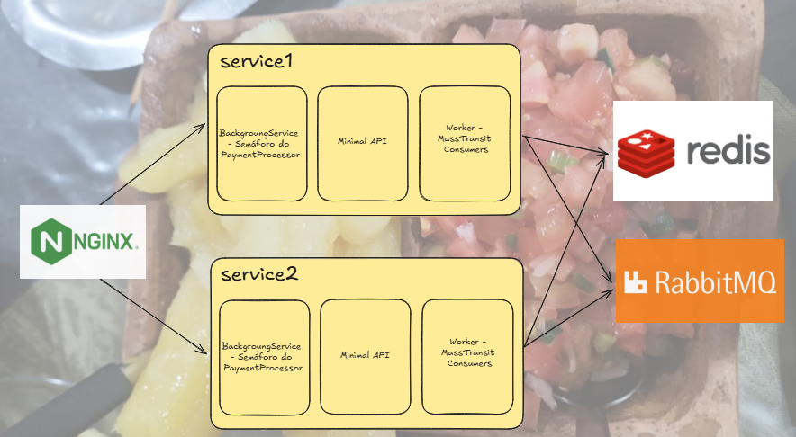

# Mandioca Cozidinha para rinha de backend de 2025

Lapidado com o que coloca o leite na mesa das criança: 

- [.NET 9](https://dotnet.microsoft.com/download/dotnet/9.0)
- [RabbitMQ (do MassTransit)](https://hub.docker.com/r/masstransit/rabbitmq)
- [Redis](https://hub.docker.com/_/redis)
- [Nginx](https://hub.docker.com/_/nginx)

## Como é a solução?


Fiz um semáforo que indica se pode ou não passar requisições pro default ou fallback do payment processor. Peguei essa implementação de Channel para fila em memória do .NET aqui e ajeitando pra esse desafio:
https://learn.microsoft.com/pt-br/aspnet/core/fundamentals/host/hosted-services?view=aspnetcore-9.0&tabs=visual-studio#:~:text=AddScoped%3CIScopedProcessingService%2C%20ScopedProcessingService%3E()%3B-,Tarefas%20em%20segundo%20plano%20na%20fila,-Uma%20fila%20de

## Como executar?
```docker-compose up -d```

E boa pa nois.