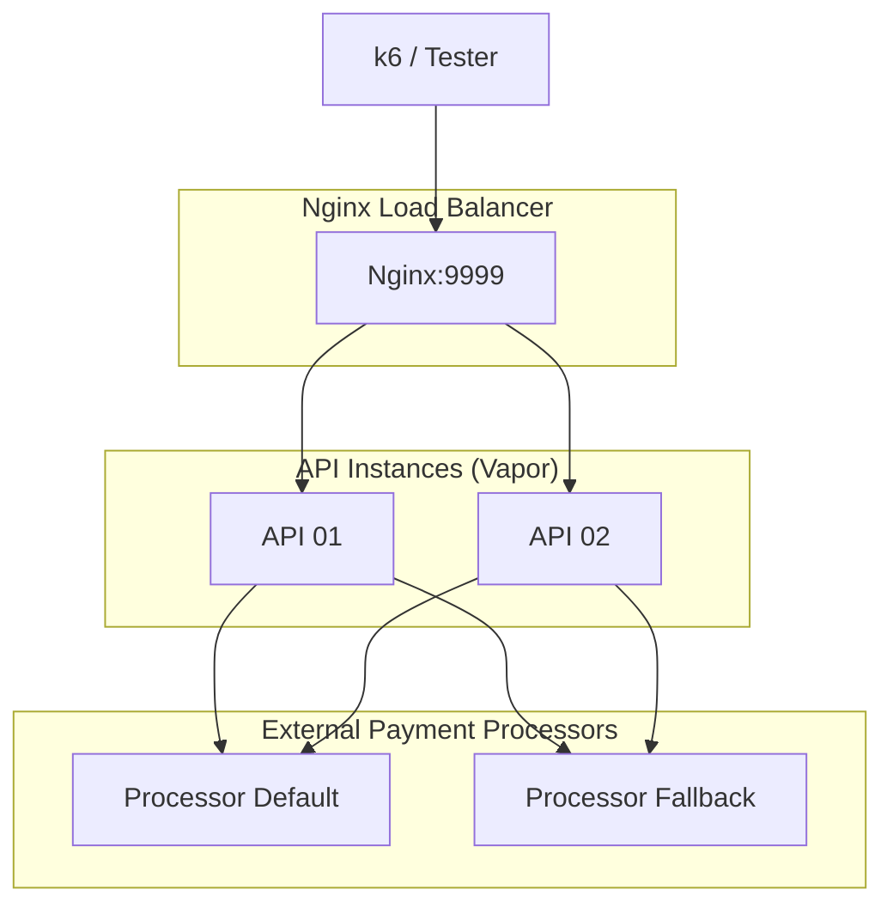

# Rinha de Backend 2025 – Backend em Swift com Vapor


---

## Visão Geral

Este repositório contém a solução em **Swift** com o framework **Vapor** para a terceira edição da **Rinha de Backend (2025)**. O objetivo é intermediar pagamentos para dois serviços de _Payment Processor_ (**default** e **fallback**) maximizando throughput e minimizando custos (quantidade de transações enviadas para o fallback).

A aplicação foi desenhada para ser **performática**, **resiliente** e **escalável** dentro das restrições do desafio (1,5 CPU / 350 MB):

- 2 instâncias _stateless_ da API escritas com [Vapor](https://vapor.codes/).
- Processamento **assíncrono** otimizado para baixa latência.
- **Nginx** faz balanceamento de carga na porta `9999`.
- **Arquitetura simples** que prioriza estabilidade e performance.



---

## 🐳 **Docker Image**

A aplicação está disponível como imagem pública no Docker Hub:

**`valcanaia/rinha-backend-2025-swift:latest`**

Esta imagem foi construída para a arquitetura **linux/amd64** e contém:
- Swift 6.0 runtime
- Vapor 4 framework
- Otimizações de performance específicas para a Rinha

---

## Endpoints Expostos

| Método | Rota                | Descrição                                                                         |
| ------ | ------------------- | --------------------------------------------------------------------------------- |
| POST   | `/payments`         | Recebe pagamento `{correlationId, amount}` e processa assincronamente. |
| GET    | `/payments-summary` | Retorna resumo agregado por processador `?from&to` (ISO-8601).                    |

Todas as requisições devem ser feitas via porta **9999** (balanceadas pelo Nginx).

---

## Como Rodar Localmente

### 1. **Pré-requisitos**
```bash
# Instalar Docker e Docker Compose
docker --version
docker-compose --version
```

### 2. **Iniciar Payment Processors**
```bash
# Navegar para o diretório dos processadores
cd payment-processor

# Iniciar processadores (ARM64 - Apple Silicon)
docker-compose -f docker-compose-arm64.yml up -d

# OU para AMD64
docker-compose up -d
```

### 3. **Iniciar Backend Swift**
```bash
# Baixar e executar (usa imagem pública)
docker-compose up -d

# Verificar se está rodando
docker-compose ps
```

### 4. **Testar a Aplicação**
```bash
# Teste básico de pagamento
curl -X POST http://localhost:9999/payments \
     -H 'Content-Type: application/json' \
     -d '{"correlationId":"'$(uuidgen)'","amount":19.90}'

# Teste do resumo
curl "http://localhost:9999/payments-summary?from=2024-01-01T00:00:00Z&to=2025-01-01T00:00:00Z"
```

---

## 🏗️ **Arquitetura Técnica**

### **Componentes:**
- **Nginx:** Load balancer com otimizações de performance
- **API Swift:** 2 instâncias com processamento assíncrono
- **In-Memory Storage:** Armazenamento otimizado para baixa latência
- **Actor Pattern:** Concorrência segura em Swift

### **Recursos Alocados:**
- **Total:** 1.5 CPU, 350MB RAM
- **Nginx:** 0.1 CPU, 30MB
- **API01:** 0.7 CPU, 160MB
- **API02:** 0.7 CPU, 160MB

### **Otimizações:**
- Actor Pattern para concorrência thread-safe
- Background queue processing com retry
- Health-based processor selection
- Connection pooling otimizado

---

## 🔗 **Links Úteis**

- **Repositório de código:** https://github.com/hvsw/rinha-de-backend-2025/
- **Docker Hub:** https://hub.docker.com/r/valcanaia/rinha-backend-2025-swift
- **Vapor Framework:** https://vapor.codes/
- **Documentação Swift:** https://swift.org/documentation/

---

**🦄 ÚNICA IMPLEMENTAÇÃO SWIFT NA RINHA DE BACKEND 2025!** 