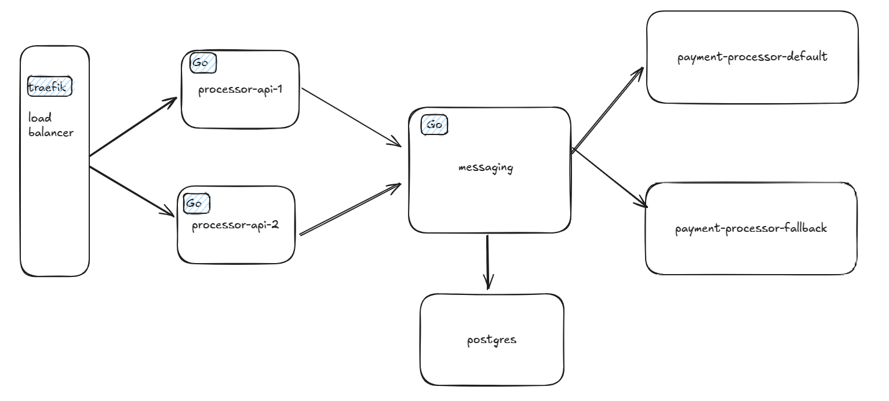

# Rinha de Backend 2025 - Submissão

## Repositório
https://github.com/jcelsocosta/rinha-backend-3ed

## Tecnologias Utilizadas
- **Linguagem:** Go
- **Armazenamento:** Postgres
- **Messaging:** Messaging
- **Balanceador:** Traefik

## Arquitetura

## Estratégia

- Utilizei o **Traefik** como load balancer.
- Processor-api: para **validação** e **bypass** das requisições.
- Um **middleware de messaging que foi desenvolvido** se conecta via **TCP** com as APIs.
- As APIs **publicam mensagens no messaging**.
- Em seguida, **workers** leem essas mensagens e realizam as requisições para:
  - `payment-processor-default`, ou
  - `payment-processor-fallback` (em caso de falha).
- Em caso de sucesso, os dados são armazenados no **PostgreSQL**.