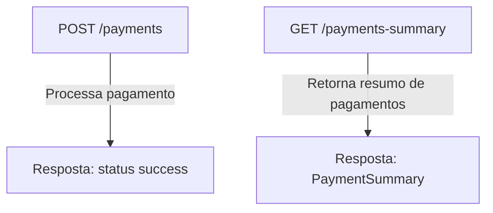

# Rinha de Backend 2025 - Jean Jacques Barros 🐔💻

Projeto desenvolvido para a competição Rinha de Backend 2025, onde o objetivo é criar uma API RESTful para pagamentos.

Repositório com o projeto: [jjeanjacques10/rinha-de-backend-2025](https://github.com/jjeanjacques10/rinha-de-backend-2025)

## Tecnologias Utilizadas 🚀

- Java 21 ☕
- Kotlin 🛠️
- Spring Boot 3.2.5 🌱
    - WebFlux 🌐
- Spring Data JPA 🗄️
- Redis 🗑️
    - Redis Streams 📜
- Docker 🐳
- GraalVM 🧪

## Estrutura do Projeto 🗂️

Segue uma tabela resumindo a estrutura do projeto:

| Caminho                                             | Descrição                                                       |
|-----------------------------------------------------|-----------------------------------------------------------------|
| `app/`                                              | Aplicação principal Spring Boot                                 |
| ├─ `Dockerfile`                                     | Dockerfile para build da aplicação                              |
| ├─ `src/main/kotlin/com/jjeanjacques/rinhabackend/` | Código-fonte Kotlin                                             |
| ├─ `docker-compose.yml`                             | Configuração do Docker Compose para a aplicação                 |
| ├─ `docker-compose-graalvm.yml`                     | Configuração do Docker Compose para a aplicação com GraalVM     |
| `payment-processor/`                                | Infraestrutura de banco e orquestração oferecido para o desafio |
| `rinha-test/`                                       | Scripts de teste de carga                                       |
| ├─ `rinha.js`                                       | Script principal de teste                                       |

## Comandos úteis 🛠️

- Gerar imagem do docker 🐳

```
docker build -t jjeanjacques10/payment-processor .
```

- Subir infraestrutura de banco e orquestração 🏗️

```
docker-compose -f payment-processor/docker-compose.yml up -d
```

## Executar os testes 🧪

### Testes de carga 📊

Para executar os testes de carga, utilize o script `rinha.js` localizado na pasta `rinha-test/`:

```
k6 run ./rinha-test/rinha.js
```

### Testes Java ☕

#### Testes Java padrão

O script `test_java.sh` realiza os seguintes passos:

1. **Compilação do projeto**: Utiliza o Maven para limpar e compilar o projeto, gerando os artefatos necessários.
2. **Construção da imagem Docker**: Cria uma imagem Docker para o projeto.
3. **Gerenciamento de containers**: Configura e inicia os serviços necessários usando Docker Compose.
4. **Configuração do K6**: Define variáveis de ambiente para o painel web do K6.
5. **Execução dos testes de carga**: Executa os testes de carga definidos no script `rinha.js`.

Para executar:

```
./test_java.sh
```

#### Testes Java com suporte ao GraalVM (em desenvolvimento)

O script `test_java_native_graalvm.sh` realiza os seguintes passos:

1. **Geração de código nativo**: Utiliza o GraalVM para preparar o projeto como uma aplicação nativa.
2. **Gerenciamento de containers**: Configura e inicia os serviços necessários usando um arquivo Docker Compose
   específico para GraalVM.
3. **Configuração do K6**: Define variáveis de ambiente para o painel web do K6.
4. **Execução dos testes de carga**: Executa os testes de carga definidos no script `rinha.js`.

Para executar:

```
./test_java_native_graalvm.sh
```

#### Publicação da imagem Docker com GraalVM

Nome da imagem local: `docker.io/jjeanjacques10/rinhabackend2025:graalvm`
Nome da imagem remota: `jjeanjacques/rinhabackend2025:graalvm-v3.0`

``` bash
docker tag docker.io/jjeanjacques10/rinhabackend2025:graalvm jjeanjacques/rinhabackend2025:graalvm-v3.0
docker push jjeanjacques/rinhabackend2025:graalvm-v3.0
```

## Endpoints 📖

Aqui está um diagrama dos endpoints disponíveis na API:



## Contribuindo 🤝

Contribuições são bem-vindas! Siga os passos abaixo para contribuir:

1. Faça um fork do repositório.
2. Crie uma branch para sua feature ou correção: `git checkout -b minha-feature`.
3. Commit suas mudanças: `git commit -m 'Adiciona minha feature'`.
4. Envie para o repositório remoto: `git push origin minha-feature`.
5. Abra um Pull Request explicando suas mudanças.
