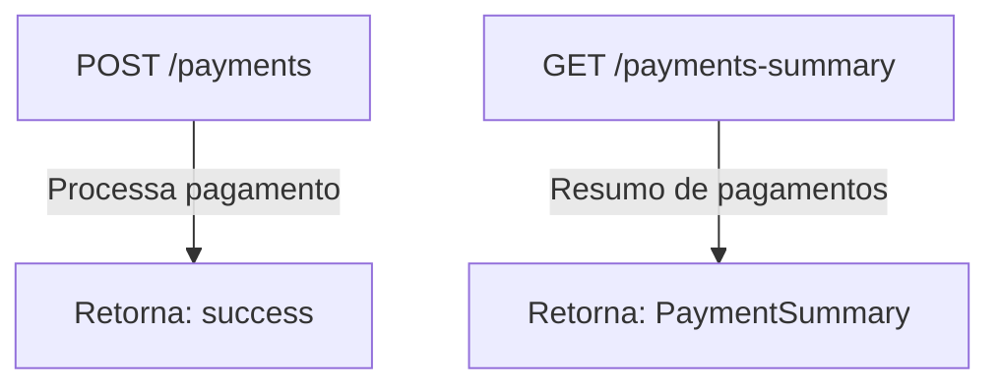

# 🐔 Rinha de Backend 2025 – Jean Jacques Barros

Este projeto foi desenvolvido para a **Rinha de Backend 2025**, uma competição onde o desafio é criar uma API RESTful de
alta performance para processamento de pagamentos.

🔗
Repositório da aplicação: [github.com/jjeanjacques10/rinha-de-backend-2025](https://github.com/jjeanjacques10/rinha-de-backend-2025)

Repositório do desafio: [zanfranceschi/rinha-de-backend-2025](https://github.com/zanfranceschi/rinha-de-backend-2025)

---

## ⚙️ Tecnologias Utilizadas

* **Java 21** / **Kotlin**
* **Spring Boot 3.2.5**

    * WebFlux (reativo)
    * Spring Data JPA
* **Redis**

    * Redis Streams
* **Docker**
* **GraalVM (build nativo)**

---

## 📁 Estrutura do Projeto

| Caminho                          | Descrição                                                     |
|----------------------------------|---------------------------------------------------------------|
| `app/`                           | Código-fonte principal (Spring Boot)                          |
| ├── `Dockerfile`                 | Build da imagem da aplicação                                  |
| ├── `src/main/kotlin/...`        | Código-fonte Kotlin                                           |
| ├── `docker-compose.yml`         | Infra de execução local                                       |
| ├── `docker-compose-graalvm.yml` | Versão otimizada com GraalVM                                  |
| `payment-processor/`             | Infraestrutura de banco e orquestração (padrão da competição) |
| `rinha-test/`                    | Scripts de teste de carga com K6                              |
| └── `rinha.js`                   | Script principal de teste                                     |

---

## 🐳 Comandos Úteis

### Build da imagem:

```bash
docker build -t jjeanjacques10/payment-processor .
```

### Subir infraestrutura da competição:

```bash
docker-compose -f payment-processor/docker-compose.yml up -d
```

---

## 🧪 Testes de Carga

### Usando o K6:

```bash
k6 run ./rinha-test/rinha.js
```

---

## ☕ Testes Automatizados

### 🔹 Testes Java (modo padrão)

Script: `test_java.sh`

Etapas:

1. Compila e empacota o projeto (Maven)
2. Constrói a imagem Docker
3. Sobe infraestrutura com Docker Compose
4. Executa o teste de carga com K6

```bash
./test_java.sh
```

---

### 🔹 Testes com GraalVM (build nativo)

Script: `test_java_native_graalvm.sh`

Etapas:

1. Gera o executável nativo com GraalVM
2. Sobe infra com Docker Compose específico
3. Executa os testes com K6

```bash
./test_java_native_graalvm.sh
```

---

### 📤 Publicação da imagem (GraalVM)

```bash
docker tag docker.io/jjeanjacques10/rinhabackend2025:graalvm jjeanjacques/rinhabackend2025:graalvm-v5.0
docker push jjeanjacques/rinhabackend2025:graalvm-v5.0
```

---

## 📖 Endpoints da API



---

## 🤝 Contribuições

Contribuições são bem-vindas! Para colaborar:

1. Faça um fork do repositório
2. Crie uma nova branch: `git checkout -b minha-feature`
3. Commit suas alterações: `git commit -m "Minha contribuição"`
4. Envie para o fork: `git push origin minha-feature`
5. Abra um Pull Request explicando sua mudança

---

Se quiser, posso gerar uma versão `.md` pronta para você subir direto no GitHub. Deseja isso também?
