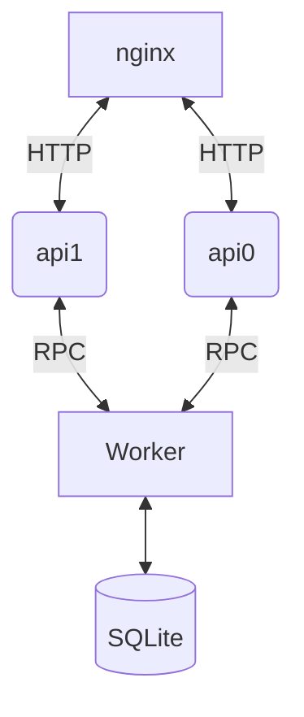

# Rinha de Backend 2025 — Rust + Axum + SQLite + rpc

Implementação da Rinha de Backend 2025 utilizando:

- [Rust](https://www.rust-lang.org/) apenas a melhor linguagem de todas
- [SQLite](https://sqlite.org/index.html) Banco de dados relacional in-process
- [Axum](https://github.com/tokio-rs/axum) framework HTTP
- [Nginx](https://nginx.org/) load balancer
- [tarpc](https://github.com/google/tarpc) easy-to-use RPC framework feito em rust

---

## Arquitetura



## Executando o binário

Este projeto define um único binário que pode rodar em dois modos:

### Modo Worker

Responsável por armazenar os pagamentos localmente com SQLite.

```bash
cargo run --release -- -m worker -p 8080 --ansi
```

### Modo API

Responsável por receber as requisições encaminhadas pelo Nginx.

```bash
cargo run --release -- -m api -p 8081 -w localhost:8080 --ansi
```
