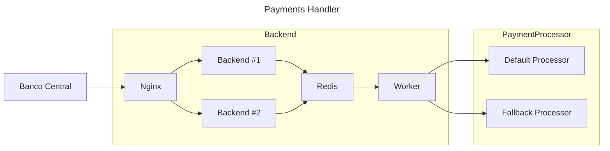

# Boogie Woogie Pay
A enterprise solution for handling payments requests. ☕

[Repository link](https://github.com/josafaverissimo/boogiewoogiepay)

## Architecture design

## Stack

- **API**: Java + Javalin
- **Worker**: Java
- **Broker**: Redis (used as a lightweight message broker)
- **Load Balancer**: Nginx
- **Orchestration**: Docker Compose

## App Flow

1. Requests are handled by Nginx, which then chooses which backend will process
the request.

2. When recieve the request, the API, just adds the request data into the Redis
queue.

3. The worker listens to the Redis queue to process request data, sending it
first to the default payment processor, and to the fallback payment processor
if the default fails.

