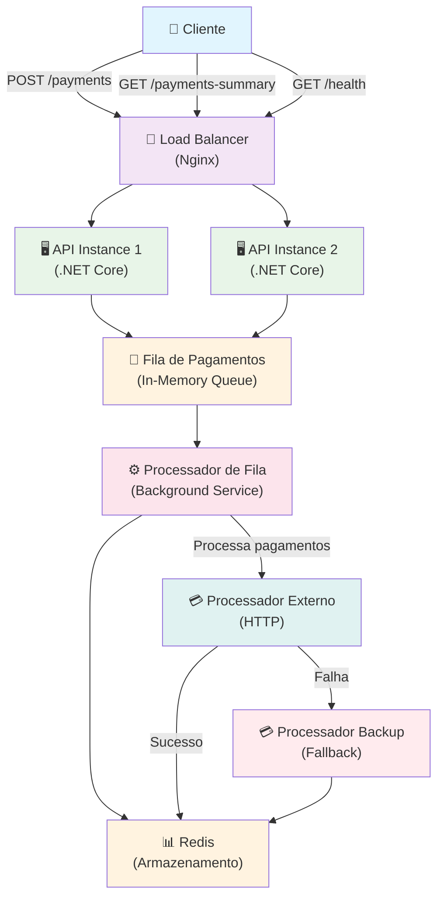

# Rinha de Backend 2025 - DOTNET 9 AOT

Um sistema simples e rápido para processar pagamentos usando C#, NET Core, Redis e nginx.

## 📋 O que faz este projeto?

Este sistema recebe pedidos de pagamento, coloca eles numa fila simples na memória e processa um por vez. Se o processador principal não funcionar, ele tenta com um processador de backup. Os dados dos pagamentos processados são salvos no Redis.

## 🏗️ Como funciona?



## 🚀 Recursos

- **📥 Recebe pagamentos**: Aceita pedidos de pagamento via API REST
- **⚡ Fila em memória**: Usa uma fila simples e rápida na memória
- **🔄 Balanceamento**: Nginx distribui as requisições entre 2 instâncias da API
- **🛡️ Backup automático**: Se o processador principal falhar, usa o backup
- **📊 Relatórios**: Mostra resumo dos pagamentos processados

## 📡 Endpoints da API

| Método | Endpoint | Descrição |
|--------|----------|-----------|
| `POST` | `/payments` | Envia um novo pagamento para processamento |
| `GET` | `/payments-summary` | Mostra resumo dos pagamentos (com filtro de data) |
| `GET` | `/health` | Verifica se o sistema está funcionando |

### Exemplo de uso:

```bash
# Enviar um pagamento
curl -X POST http://localhost:9999/payments \
  -H "Content-Type: application/json" \
  -d '{
    "correlationId": "guid",
    "amount": 100.50
  }'

# Ver resumo dos pagamentos
curl http://localhost:9999/payments-summary
```

## 🛠️ Tecnologias usadas

- **C#** e **.NET Core** - A linguagem e framework principal
- **Redis** - Para armazenar dados dos pagamentos processados
- **Nginx** - Para balancear as requisições
- **Docker** - Para rodar tudo junto facilmente

## 🏃‍♂️ Como rodar

1. **Clone o projeto:**
   ```bash
   git clone https://github.com/leeozaka/rinha-csharp.git
   cd rinha-csharp
   ```

2. **Rode com Docker:**
   ```bash
   docker-compose up
   ```

3. **Pronto!** O sistema estará rodando em `http://localhost:9999`

## 📈 Performance

- Duas instâncias da API rodando em paralelo
- Fila rápida em memória para processar pagamentos
- Processamento em background
- Sistema de fallback para garantir que os pagamentos sejam processados
- Redis para persistir dados dos pagamentos processados

## 👨‍💻 Autor

**Leonardo Neves**
- GitHub: [@leeozaka](https://github.com/leeozaka)
- LinkedIn: [Leonardo Neves](https://linkedin.com/in/leeonardoneves)