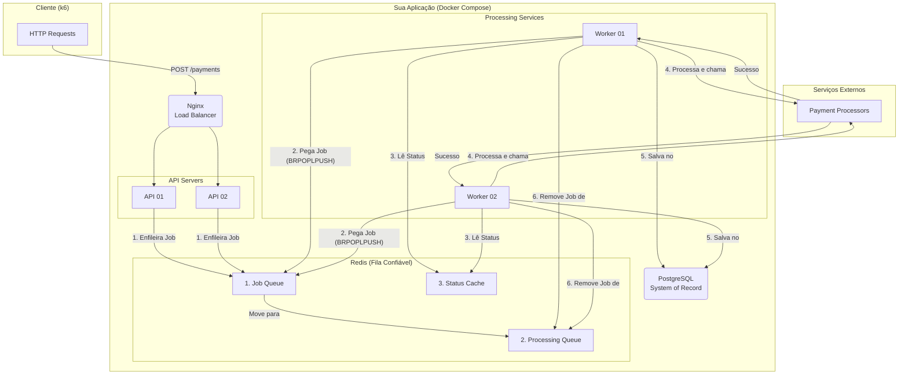

# Rinha de Backend 2025 - Submissão com Node.js + TypeScript

**Repositório do Código-Fonte:** https://github.com/Luzin7/rinha-backend-2025-ts-nodejs

## Stack Tecnológica

* **Linguagem:** TypeScript
* **Runtime:** Node.js
* **Framework API:** Fastify
* **Load Balancer:** Nginx
* **Fila & Cache:** Redis
* **Banco de Dados:** PostgreSQL
* **I/O Drivers:** undici e pg

---

## Arquitetura

A solução foi projetada seguindo os princípios de microsserviços e uma arquitetura orientada a eventos.

### Diagrama do Fluxo

