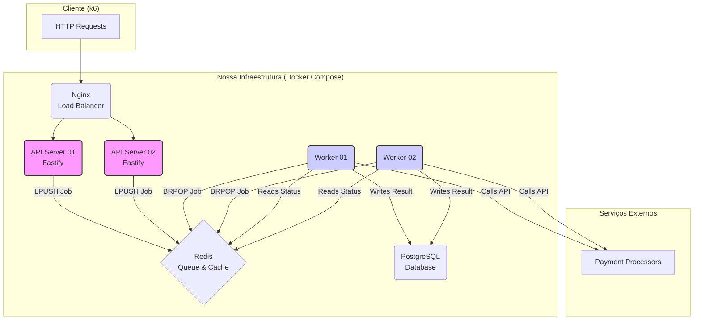

# Rinha de Backend 2025 - Submissão com Node.js + TypeScript

This is a project set up by [Confectus](https://www.npmjs.com/package/confectus).

**Repositório do Código-Fonte:** https://github.com/Luzin7/rinha-backend-2025-ts-nodejs

## Stack Tecnológica

- **Linguagem** : TypeScript
- **Runtime** : Node.js
- **Framework API** : Fastify
- **Load Balancer** : Nginx
- **Fila & Cache** : Redis
- **Banco de Dados**: PostgreSQL
- **I/O Drivers** : `undici` & `pg`

---

## Arquitetura

A solução foi projetada seguindo os princípios de microsserviços e uma arquitetura orientada a eventos para garantir **alta vazão (throughput)** e **resiliência**.

### Diagrama do Fluxo

### Descrição dos Componentes

- **Nginx:** Atua como **Load Balancer**, recebendo todo o tráfego na porta `9999` e distribuindo de forma equitativa entre as duas instâncias da API. Foi otimizado com `keepalive` para reutilizar conexões e minimizar a latência.

- **API Servers (Fastify):** Duas instâncias de um servidor Fastify extremamente leves. Sua única responsabilidade é lidar com requisições `POST /payments`, validar os dados com Zod, criar uma `job message` e empurrá-la para a **queue** no Redis. A resposta `202 Accepted` é imediata para proteger o que der no `p99`.

- **Redis:** Serve duas funções críticas:
  1.  **Job Queue (`payment_queue`):** Funciona como um **Message Broker**, desacoplando os **API Servers** dos **Workers**.
  2.  **Status Cache:** Armazena o estado de saúde (`UP`/`DOWN`) dos Payment Processors, servindo como `cache` para a lógica do **Circuit Breaker**.

- **Workers:** O coração do sistema, rodando em contêineres dedicados para não competir por recursos com as APIs. Eles operam em um loop infinito, seguindo o padrão **Competing Consumers**:
  1.  Pegam tarefas da **queue** no Redis.
  2.  Consultam o **Status Cache** para decidir qual processador usar.
  3.  Executam a chamada HTTP para o serviço externo.
  4.  Persistem o resultado final no PostgreSQL.
      A concorrência interna (`MAX_CONCURRENT_JOBS`) é ajustada para balancear a carga com a capacidade do `pool` de conexões do banco de dados.

- **Watcher:** É um processo em background rodando junto com os **Workers**. A cada 5 segundos, um deles (eleito via **distributed lock** no Redis) consulta o endpoint `/health-check` dos processadores e atualiza o **Status Cache**, implementando um padrão de **Circuit Breaker Proativo**.

- **PostgreSQL:** Armazena de forma durável todos os pagamentos que foram processados com sucesso. O `schema` foi otimizado com um **index** na coluna `processor` para acelerar as consultas do `summary`.

---

### Estratégias de Otimização

- **Escalabilidade Horizontal:** Múltiplas instâncias de **API** e **Worker** para dividir a carga de trabalho.
- **Circuit Breaker Proativo:** O padrão **Watcher** evita fazer chamadas a serviços que já se sabe que estão falhando, economizando tempo e recursos.
- **I/O de Alta Performance:** Uso de `undici` e `pg` para controle de baixo nível e mínimo `overhead` nas operações de rede e banco de dados.
