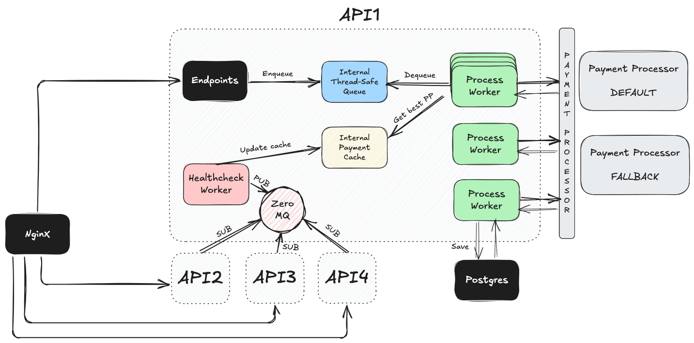

# Rinha de Backend 

O case dessa rinha ficou excelente, então parabéns aos organizadores do evento!

[Repositório do Projeto](https://github.com/laurentino14/rinha-2025)
## Tech Stack

- Linguagem: GoLang
- HTTP Server: FastHTTP
- Comunicação: ZeroMQ
- Load Balancer: NginX
- Banco de dados: PostgreSQL


## Arquitetura




## Execução do Projeto

Basta utilizar o comando abaixo e aguardar os logs a seguir para garantir que tudo ocorreu de bem.

```bash
docker compose up
```
ou
```bash
docker-compose up
```

```sh
api1      | 2025/07/18 05:04:34 Server listening on 0.0.0.0:9999
api2      | 2025/07/18 05:04:34 Server listening on 0.0.0.0:9999
api4      | 2025/07/18 05:04:34 Server listening on 0.0.0.0:9999
api3      | 2025/07/18 05:04:34 Server listening on 0.0.0.0:9999
nginx     | /docker-entrypoint.sh: Configuration complete; ready for start up
```