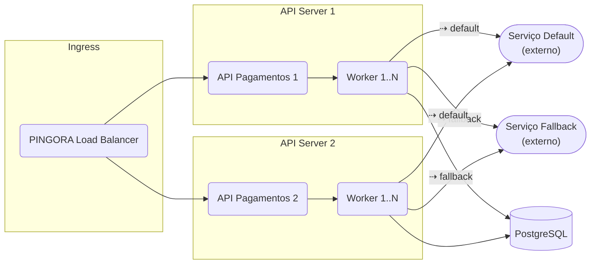

# Rinha de Backend 2025 - Implementação em Go

Esta é a minha submissão para a **Rinha de Backend 2025**, desenvolvida em **GO**.

## Tecnologias Utilizadas:

- **Go 1.24** ‑ concorrência nativa e binário enxuto
- **PostgreSQL** para persistência

## Topologia de Alto Nível (Processamento de pagamentos)

- **PINGORA** atua como load balancer, distribuindo as requisições entre os servidores de API.
- Cada **API Pagamentos** possui seu próprio **Worker** que recebe requisições através de uma fila em memória.
- O **Worker** determina qual serviço de pagamento utilizar (default ou fallback) com base na disponibilidade e desempenho.
- Após o processamento bem-sucedido, o **Worker** envia o resultado para o **Storage**, que insere os pagamentos no PostgreSQL em lotes.
- Em caso de falha, o **Worker** implementa uma estratégia de retry com backoff exponencial.

## Arquitetura Interna do Worker

1. **Múltiplos Workers por Servidor**
    - Cada servidor API cria múltiplas goroutines de worker (baseado no número de CPUs disponíveis)
    - Os workers processam as requisições de forma concorrente, maximizando o throughput

2. **Fila em Memória**
    - Os workers recebem requisições através de uma fila em memória de alta capacidade (32768 mensagens)
    - O handler HTTP submete as requisições para a fila, permitindo resposta rápida ao cliente

3. **Determinação do Processador**
    - O worker consulta o `ServiceMonitor` para determinar qual processador usar (default ou fallback)
    - A escolha é baseada na disponibilidade e desempenho recente de cada processador

4. **Processamento Paralelo**
    - Para cada requisição:
        - Chama o serviço HTTP adequado (`default` ou `fallback`) em _goroutine_
        - Em caso de falha, o serviço utilizado é marcado como não disponível

5. **Persistência e Retry**
    - Sucesso → envia o pagamento para o Storage, que utiliza um buffer em memória
    - O Storage agrupa os pagamentos em lotes de até 100 registros para inserção eficiente no PostgreSQL
    - Os lotes são enviados ao banco quando atingem o tamanho máximo ou após 2ms
    - Falha transitória → implementa retry com _exponential backoff_ de até 2 segundos

## Monitoramento de Saúde dos Processadores

O sistema utiliza um `ServiceMonitor` para monitorar continuamente a saúde dos processadores de pagamento:

- Verifica periodicamente a disponibilidade dos serviços de pagamento (default e fallback)
- Mantém estatísticas de desempenho e disponibilidade
- Determina qual processador usar com base nas condições atuais
- Adapta-se automaticamente a falhas ou degradação de desempenho

## Estratégia de Retry

Para garantir a resiliência do sistema:

- Implementa retry com backoff exponencial (até 2 segundos)
- Adiciona jitter para evitar thundering herd
- Limita o número máximo de tentativas para evitar sobrecarga
- Utiliza uma fila de prioridade para gerenciar os retries de forma eficiente