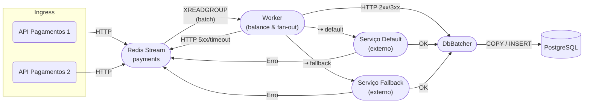

# Rinha de Backend 2025 - Implementação em Go

Esta é a minha submissão para a **Rinha de Backend 2025**, desenvolvida em **GO**.

## Tecnologias Utilizadas:

- **Go 1.24** ‑ concorrência nativa e binário enxuto
- **Redis Streams** para enfileiramento dos pedidos de pagamento
- **PostgreSQL** para persistência

## Topologia de Alto Nível (Processamento de pagamentos)

- **API Pagamentos** recebe a requisição, a serializa e faz `XADD` no stream.
- **Worker** consome em lote, chama serviços externos de pagamento em paralelo e, ao final, envia os resultados
  aprovados para o **DbBatcher**.
- **DbBatcher** agrega várias confirmações e faz um `COPY … FROM STDIN` (ou lote de INSERTs) para o PostgreSQL,
  reduzindo round-trips e aumentanto IOPS efetivos.

## Arquitetura Interna do Worker

1. **Leitura em lote**
    - Usa `XREADGROUP COUNT=N BLOCK=...` coletando até 200 mensagens ou até um intervalo de 5ms.

2. **Cálculo do Work Factor**
    - Invoca `ServiceMonitor.CalculateServiceRequests(total)`, retornando quantas mensagens devem ir para cada
      processador (`default` x `fallback`) com objetivo de **maximizar lucro** (detalhes abaixo).

3. **Balanceador por Fator de Trabalho**
    - Estrutura `workFactorBalancer` distribui as mensagens alternadamente até que cada quota seja atingida.

4. **Fan-out paralelo**
    - Para cada mensagem:
        - Reserva vaga em um **semáforo** (com um máximo de 50 requests paralelas), garantindo que o host não sature CPU
          ou banda.
        - Chama o serviço HTTP adequado (`default` ou `fallback`) em _goroutine_.
        - Os serviços de pagamento são chamados alternadamente para evitar saturação (a depender do workFactorBalancer).
        - Em caso de falha o serviço utilizado é marcado como não disponível.

5. **Push para DbBatcher**
    - Sucesso → envia struct pagamento para o dbBatcher.
    - Falha transitória → reenvia mensagem para fila com um _exponential backoff_ de até 10s.

### Por que DbBatcher separado?

Agregando confirmações em blocos conseguimos:

- Menos RTT (Round trip time)
- Uso de `COPY` reduz overhead de parsing / planejamento.
- Worker continua “livre” para I/O de rede enquanto o lote é gravado.

## Cálculo do Work Factor

Objetivo: **maximizar lucro esperado** para `n` mensagens dadas as restrições de disponibilidade e taxa de cada serviço.

#### **Work Factor (W)**

L = (1 - taxa) × 1000ms / (minResponseTime)

      L_default = (1 - 0.05) × 1000ms / (Default_minResponseTime)
      L_fallback = (1 - 0.15) × 1000ms / (Fallback_minResponseTime)
      
      z = L_default + L_fallback

      W_default = round( (L_default / z) * n)
      W_fallback = n - W_default
      

O **work factor** muda a cada lote, adaptando-se a oscilações de rede ou SLA externo, mantendo o ticket médio de lucro o mais alto possível.

