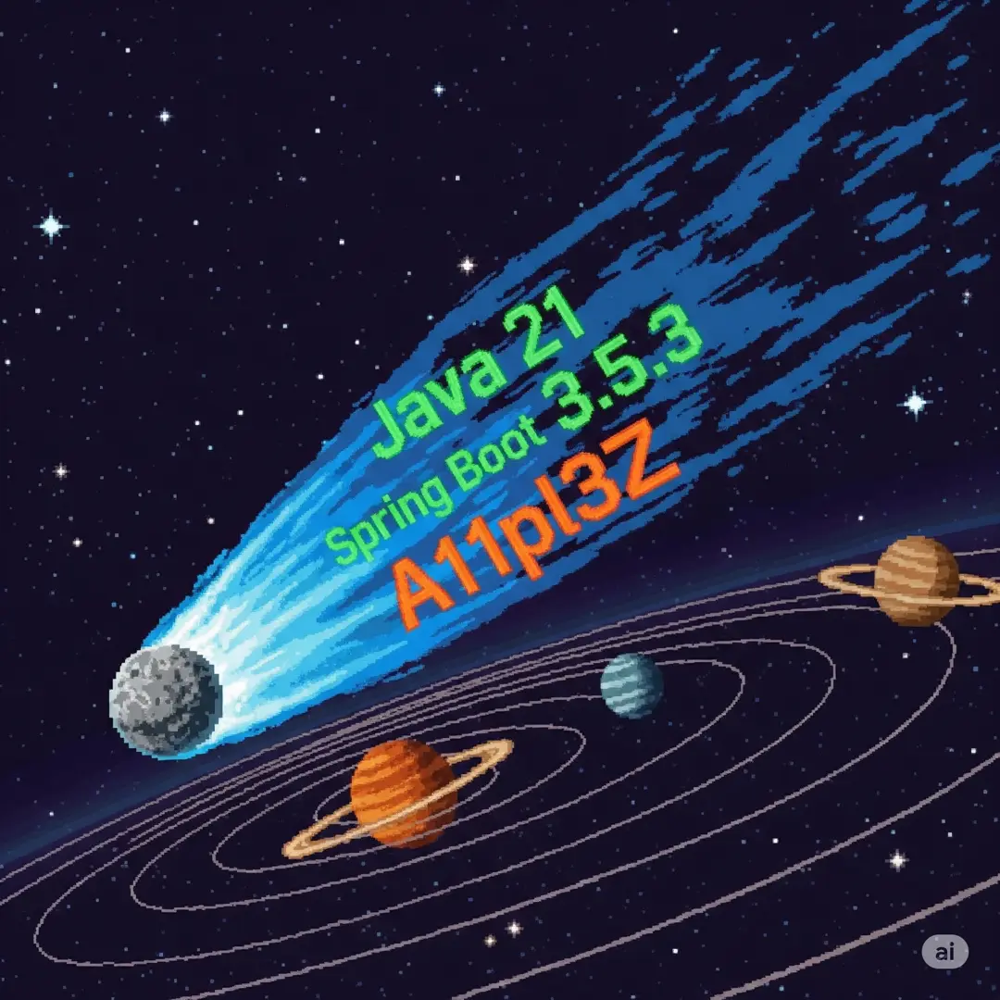

Ser um projeto mais proximo do dia-a-dia do javeiro

## Repositório
https://github.com/marcosisocram/A11pl3Z

## Tecnologias
- **Linguagem:** Java 21
- **Armazenamento:** PostgreSQL
- **Messaging:** RabbitMQ
- **Balanceador:** HAProxy
- **Outros:** GraalVM, String Boot 3.5.3, JOOQ

## Arquitetura

## Dificuldades
- Limite de memoria de 350MB, por ter muitos serviços na arquitetura

## Projeto Alternativo
- [DAISY](https://github.com/marcosisocram/daisy) feito para ser mais rapido e com estratégias duvidosas
