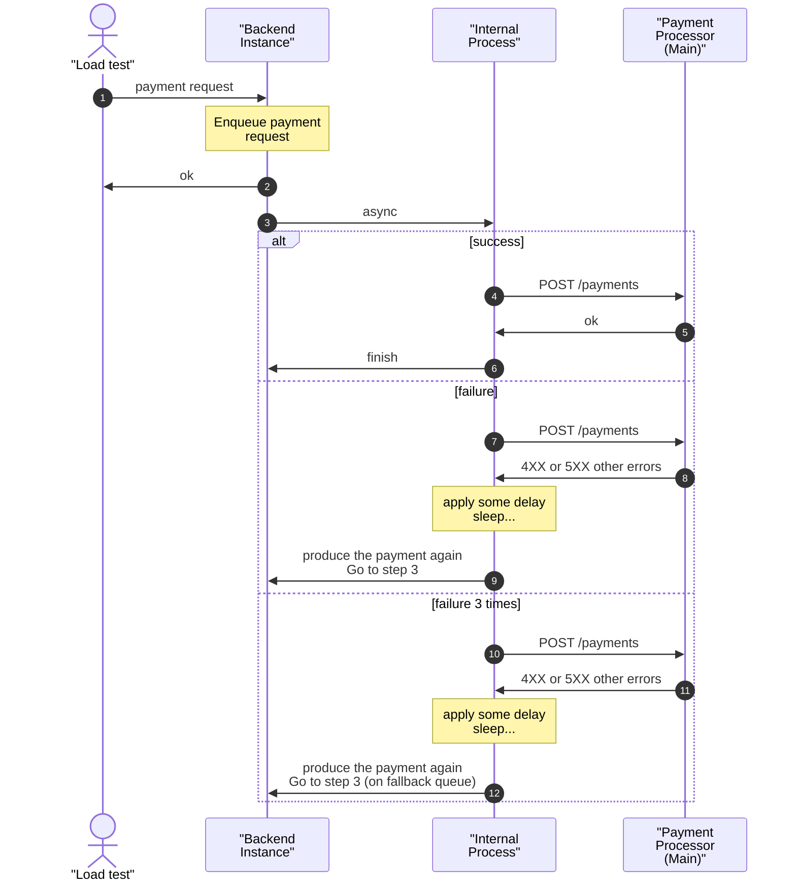

## Solução

Linguagem utilizada: Go.

Premissa: Todas as requests serão processadas assíncronamente (sem utilizar brokers como kafka, rabbitmq, etc);

### Como???

Utilização de goroutine e channels:



### Outras informações

```json
{
    "name": "Marcus Adriano",
    "social": ["hhttps://www.linkedin.com/in/marcusadriano"],
    "source-code-repo": "https://github.com/MarcusAdriano/rinha-de-backend-2025",
    "langs": ["go"],
    "storages": ["postgresql"],
    "messaging": [],
    "load-balancers": ["nginx"]
}
```