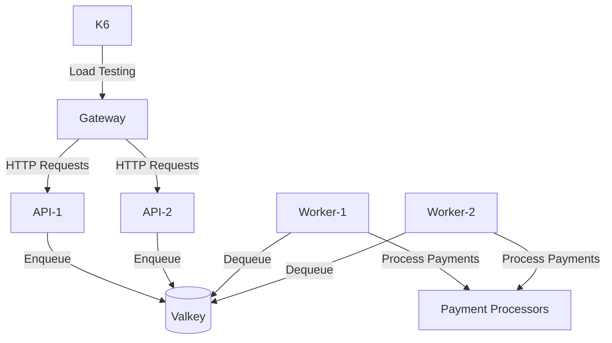

# Rinha de Backend 2025

Implementação do desafio da **Rinha de Backend 2025** utilizando **Typescript**, **ElysiaJS** e **Bun**.

Repositório do projeto: [https://github.com/mateuxlucax/rinha-de-backend-2025](https://github.com/mateuxlucax/rinha-de-backend-2025)

## Fluxo básico

## Tecnologias utilizadas

- **Servidor HTTP**: [ElysiaJS](https://elysiajs.com/)
- **Balanceador de carga**: [HaProxy](https://haproxy.org/)
- **Armazenamento**: [Valkey](https://valkey.dev/)
- **Mensageria**: [Valkey](https://valkey.dev/)
- **Orquestração**: [Docker](https://www.docker.com/)
- **Linguagem principal**: [Typescript](https://www.typescriptlang.org/)
