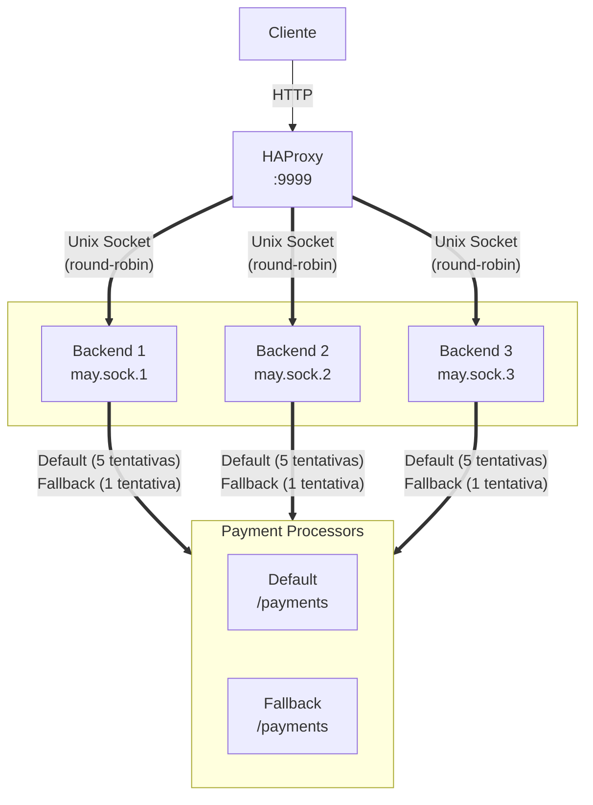

# 🦀 Rust + Coroutines
Repositório: https://github.com/not4rt/rinha-2025

## Stack

- **Rust** com coroutines ([May](https://github.com/Xudong-Huang/may))
- **HAProxy** para load balancing
- **Unix Sockets** para comunicação entre o load balancer e backends
- **MiMalloc** como alocador, consome mais memória, porém tem uma performance média melhor
- **may_minihttp** [fork customizado](https://github.com/not4rt/may_minihttp) com suporte a Unix sockets

## Escolhas Técnicas

### Por que Unix Sockets?
Baseado na submissão do Alan Silva, tive que criar um fork do may_minihttp para adicionar suporte a unix sockets. Dessa forma, HAProxy e backends podem conversar com menor overhead de rede.

### Por que tanto Unsafe?
Queria testar quais seriam os ganhos ao abandonar as checagens de segurança do rust.

## Arquitetura

## Otimizações

- **Buffers pré-alocados**: Quase zero alocações no hot path
- **Parsing manual**: Tentativa para diminuir o overhead do serde_json
- **Descarte de conexões com erro**: Quando possível reutiliza conexões tcp para o payment-processor, quando um erro é retornado (status 422) a conexão é descartada
- **Lock-free hashmaps**: DashMap para estatísticas
- **MPMC channels**: Desacopla I/O de processamento

## ⚠️ Atenção

Este código prioriza performance sobre tudo e não deve ser utilizado como referência pois:
- Uso extensivo de `unsafe`
- Sem tratamento erros
- Otimizado para o caso específico da Rinha

## Aprendizados

1. Na maior parte das vezes, abandonar checagens de segurança por performance não vale a pena (diferença de microsegundos)
2. Coroutines são subestimadas vs async/await
3. Unix sockets > TCP para comunicação local
4. Às vezes vale a pena escrever seu próprio parser
5. Modificar crates existentes pode melhorar a performance em casos específicos (fork do may_minihttp para suportar Unix sockets!)