# Rinha de Backend 2025 - Sistema de Intermediação de Pagamentos

**Autor:** Ricássio Costa
**Data:** Julho 2025  
**Versão:** 1.0

## Visão Geral

Este projeto implementa um backend para o desafio "Rinha de Backend 2025". O projeto foi desenvolvido em Javascript usando Node.js, utilizando práticas modernas de desenvolvimento assíncrono e integração com gateways de pagamento.

## Descrição

O sistema é responsável por processar pagamentos de forma resiliente, utilizando múltiplos gateways e realizando fallback automático em caso de falha.

## Arquitetura



```mermaid
graph TD
    %% Seções principais
    subgraph CLIENT
        A[Usuário/Cliente_HTTP]
    end

    subgraph LOAD_BALANCER
        B[Nginx]
    end

    subgraph BACKEND
        C1[BE1_API+Worker]
        C2[BE2_API+Worker]
        HC[HealthCheck_Worker]
    end

    subgraph REDIS
        RQ[Redis_Queue]
        RD[Redis_Database]
    end

    subgraph GATEWAYS
        PG1[Gateway_1]
        PG2[Gateway_2]
    end

    %% Fluxo de requisições
    A --> B
    B --> C1
    B --> C2

    %% API e Worker consumindo fila
    C1 --> RQ
    C2 --> RQ

    %% API enviando pagamentos pros gateways
    C1 --> PG1
    C1 --> PG2
    C2 --> PG1
    C2 --> PG2

    %% API salvando resultado no Redis
    C1 --> RD
    C2 --> RD

    %% Health Check monitorando gateways
    HC --> PG1
    HC --> PG2

    %% Health Check atualizando status nos BEs
    HC --> C1
    HC --> C2
```

## Recursos Alocados (docker-compose)

| Serviço       | CPUs | Memória |
| ------------- | ---- | ------- |
| nginx         | 0.2  | 48MB    |
| backend-api-1 | 0.6  | 108MB   |
| backend-api-2 | 0.6  | 108MB   |
| redis         | 0.1  | 86MB    |
| **Total**     | 1.5  | 350MB   |

## Estrutura do Projeto

```
├── src/
│   ├── config.ts         # Configurações do sistema
│   ├── healthCheck.ts    # Worker de healthcheck dos gateways
│   ├── main.ts           # Ponto de entrada da API
│   ├── models.ts         # Tipos e interfaces TypeScript
│   ├── client.ts         # Cliente HTTP e comunicação com gateways
│   ├── queueWorker.ts    # Worker assíncrono para processamento
│   └── storage.ts        # Persistência de dados no Redis
├── package.json          # Dependências do projeto
├── tsconfig.json         # Configuração do TypeScript
├── Dockerfile            # Dockerização da aplicação
├── docker-compose.yml    # Orquestração de containers
├── nginx.conf            # Configuração do Nginx
└── README.md
```

## Como rodar o projeto

1. **Clone o repositório:**

   ```bash
   git clone <url-do-repositorio>
   cd backend-para-rinha-2025/node
   ```

2. **Instale as dependências (desenvolvimento local):**

   ```bash
   npm install
   ```

3. **Configure as variáveis de ambiente:**

   - As variáveis são configuradas no `docker-compose.yml`.

4. **Suba os containers:**

   ```bash
   docker-compose up --build
   ```

5. **Acesse a aplicação:**
   - Os endpoints estarão disponíveis na porta 9999.

## Scripts Disponíveis

- `npm run build` — Compila o TypeScript
- `npm start` — Inicia a aplicação compilada
- `npm run dev` — Executa em modo desenvolvimento
- `npm run dev:watch` — Executa em modo desenvolvimento com auto-reload

## Principais Funcionalidades

- Processamento resiliente de pagamentos
- Fallback automático entre gateways
- Healthcheck dos serviços integrados
- Estrutura modular e fácil de manter
- Sistema de filas em memória com workers assíncronos
- Cache distribuído via Redis

## Tecnologias Utilizadas

- Node.js 18+
- TypeScript
- Fastify (servidor HTTP)
- Redis (cache e persistência)
- Axios (requisições HTTP)
- Docker & Docker Compose

## Endpoints da API

### POST /payments

Adiciona um pagamento na fila para processamento.

**Request Body:**

```json
{
  "correlationId": "string",
  "amount": number
}
```

**Response:** Status 202 (Accepted)

### GET /payments-summary

Retorna resumo de pagamentos processados.

**Query Parameters:**

- `from` (opcional): Data de início (ISO 8601)
- `to` (opcional): Data de fim (ISO 8601)

**Response:**

```json
{
  "default": {
    "totalRequests": number,
    "totalAmount": number
  },
  "fallback": {
    "totalRequests": number,
    "totalAmount": number
  }
}
```

### POST /purge-payments

Remove todos os pagamentos armazenados.

**Response:**

```json
{
  "status": "payments purged"
}
```

## Arquitetura

1. **API Fastify** - Recebe requisições HTTP
2. **Queue Worker** - Processa pagamentos assincronamente
3. **Health Check Service** - Monitora saúde dos gateways
4. **Redis** - Cache distribuído e persistência
5. **Load Balancer** - Nginx distribui requisições

## Scripts Úteis

- `docker-compose up --build` — Sobe a aplicação e dependências
- `docker-compose down` — Para e remove os containers
- `docker-compose logs -f` — Visualiza logs em tempo real

## Licença

Este projeto está licenciado sob a licença MIT.

---

Desenvolvido para o desafio Rinha de Backend 2025 🚀
