# Rinha de Backend 2025 - Sistema de Intermediação de Pagamentos

**Autor:** Ricássio Costa
**Data:** Julho 2025  
**Versão:** 1.0

## Visão Geral

Este projeto implementa um backend para o desafio "Rinha de Backend 2025". O projeto foi desenvolvido em Python, utilizando práticas modernas de desenvolvimento assíncrono e integração com gateways de pagamento.

## Descrição

O sistema é responsável por processar pagamentos de forma resiliente, utilizando múltiplos gateways e realizando fallback automático em caso de falha.

## Arquitetura

```mermaid
graph TD
    %% Seções principais
    subgraph CLIENT
        A[Usuário/Cliente_HTTP]
    end

    subgraph LOAD_BALANCER
        B[Nginx]
    end

    subgraph BACKEND
        C1[BE1_API+Worker]
        C2[BE2_API+Worker]
        HC[HealthCheck_Worker]
    end

    subgraph REDIS
        RQ[Redis_Queue]
        RD[Redis_Database]
    end

    subgraph GATEWAYS
        PG1[Gateway_1]
        PG2[Gateway_2]
    end

    %% Fluxo de requisições
    A --> B
    B --> C1
    B --> C2

    %% API e Worker consumindo fila
    C1 --> RQ
    C2 --> RQ

    %% API enviando pagamentos pros gateways
    C1 --> PG1
    C1 --> PG2
    C2 --> PG1
    C2 --> PG2

    %% API salvando resultado no Redis
    C1 --> RD
    C2 --> RD

    %% Health Check monitorando gateways
    HC --> PG1
    HC --> PG2

    %% Health Check atualizando status nos BEs
    HC --> C1
    HC --> C2
```



## Recursos Alocados (docker-compose)

| Serviço       | CPUs | Memória |
| ------------- | ---- | ------- |
| nginx         | 0.2  | 16MB    |
| backend-api-1 | 0.6  | 64MB    |
| backend-api-2 | 0.6  | 64MB    |
| health-check  | 0.05 | 43MB    |
| redis         | 0.05 | 43MB    |
| **Total**     | 1.5  | 350MB   |

## Estrutura do Projeto

```
├── app/
│   ├── __init__.py
│   ├── config.py         # Configurações do sistema
│   ├── health_check.py   # Worker de healthcheck dos gateways
│   ├── main.py           # Ponto de entrada da API
│   ├── models.py         # Modelos de dados
│   ├── processor.py      # Processamento e envio de pagamentos
│   ├── queue_worker.py   # Gerenciamento de filas
│   └── storage.py        # Persistência de dados
├── requirements.txt      # Dependências do projeto
├── Dockerfile            # Dockerização da aplicação
├── docker-compose.yml    # Orquestração de containers
├── nginx.conf            # Configuração do Nginx
└── LICENSE
```

## Como rodar o projeto

1. **Clone o repositório:**

   ```bash
   git clone <url-do-repositorio>
   cd backend-para-rinha-2025
   ```

2. **Configure as variáveis de ambiente:**

   - Edite o arquivo `.env` (se necessário) ou ajuste as variáveis diretamente no `docker-compose.yml`.

3. **Suba os containers:**

   ```bash
   docker-compose up --build
   ```

4. **Acesse a aplicação:**
   - Os endpoints estarão disponíveis conforme configurado no `docker-compose.yml`.

## Principais Funcionalidades

- Processamento resiliente de pagamentos
- Fallback automático entre gateways
- Healthcheck dos serviços integrados
- Estrutura modular e fácil de manter

## Tecnologias Utilizadas

- Python 3.12+
- httpx (requisições assíncronas)
- Docker & Docker Compose

## Scripts Úteis

- `docker-compose up --build` — Sobe a aplicação e dependências
- `docker-compose down` — Para e remove os containers

## Licença

Este projeto está licenciado sob a licença MIT. Veja o arquivo `LICENSE` para mais detalhes.

---

Desenvolvido para o desafio Rinha de Backend 2025 🚀
