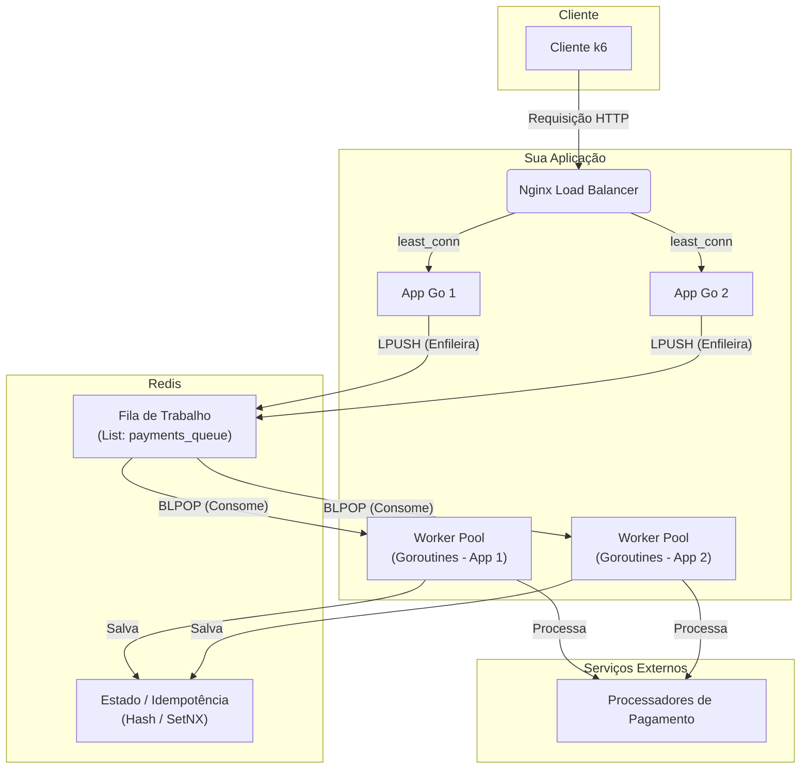

# Submissão Rinha de Backend 2025 - [Rodrigo Militão]

Implementação desenvolvida em Go, focada em uma arquitetura assíncrona, resiliente e de alta performance.

## Link para o Repositório do Código Fonte

[https://github.com/rodrigo-militao/go-rinha-backend-2025](https://github.com/rodrigo-militao/go-rinha-backend-2025)

## Arquitetura Escolhida

A solução utiliza um sistema de workers assíncronos para processar os pagamentos. Um Nginx atua como load balancer para duas instâncias da aplicação Go. As requisições são enfileiradas no Redis (usando Listas como fila de trabalho) e consumidas por um pool de goroutines. A idempotência e o estado final são gerenciados pelo PostgreSQL / Redis (adapte conforme sua escolha final). O sistema também implementa um Circuit Breaker com health checks para lidar com a instabilidade dos processadores de pagamento.

## Stack de Tecnologias

- **Linguagem:** Go
- **Banco de Dados:** Redis
- **Fila/Mensageria:** Redis
- **Load Balancer:** Nginx