# 🦀 Rinha de Backend - Samuel Panzera 🦀

Este projeto é a minha participação na Rinha de Backend! O foco principal foi construir uma API de pagamentos com a **máxima performance** possível, explorando tecnologias e arquiteturas que otimizam a velocidade e o uso de recursos ao extremo.

## 🎯 O Intuito do Projeto

A meta era clara: criar a API mais rápida e eficiente possível para o desafio. Para isso, tomei algumas decisões técnicas ousadas, mas que se mostraram cruciais para atingir os objetivos de performance no contexto da "rinha".

## 🛠️ Stacks e Tecnologias Utilizadas

- **Linguagem:** 🦀 **Rust** - Escolhido pela sua performance incomparável, segurança de memória e capacidades de concorrência de baixo nível.
- **Framework Web:** ⚙️ **May/May-MiniHttp** - Um framework Rust minimalista que utiliza corrotinas (green threads), permitindo um altíssimo grau de concorrência com um custo muito baixo de recursos.
- **Banco de Dados:** Memoria compartilhada para Máxima perfomance
- **Load Balancer:** **Nginx** - Para distribuir a carga de forma eficiente entre duas instâncias da API, garantindo alta disponibilidade e escalabilidade horizontal.
- **Containerização:** 🐳 **Docker & Docker Compose** - Para facilitar a configuração, o deploy e a execução de todo o ambiente de forma consistente.

## 🏗️ Decisões Técnicas e Arquitetura

```mermaid
flowchart LR
    Client["👤 Cliente"] --> LB["🔄 Nginx<br>:9999"]
    LB --> API1["🦀 API 1<br>May/MiniHttp"] & API2["🦀 API 2<br>May/MiniHttp"]
    API1 --> SM[("🧠 Shared Memory<br>Memory-Mapped File")] & EXT["🌐 Payment Processors<br>"]
    API2 --> SM & EXT
     LB:::balancer
     API1:::api
     API2:::api
     SM:::storage
     EXT:::external
    classDef api fill:#f9a,stroke:#333,stroke-width:2px
    classDef storage fill:#ff9,stroke:#333,stroke-width:3px
    classDef external fill:#99f,stroke:#333,stroke-width:2px
    classDef balancer fill:#9f9,stroke:#333,stroke-width:2px
    style LB fill:#000000
```



### 🏗️ Fluxo de Processamento de Pagamentos

1. **📥 Recepção:** Cliente envia POST /payments → Nginx distribui para API1 ou API2
2. **⚡ Queue Assíncrona:** Payment Handler coloca pagamento na fila assíncrona (canal mpsc)
3. **🔄 Worker Background:** Worker processa pagamentos de forma assíncrona:
   - Tenta 5x no processador padrão (com delay de 500ms entre tentativas)
   - Se falhar, usa o processador fallback
4. **💾 Persistência:** Sucesso → salva na memória compartilhada (atomic operations)
5. **📊 Consulta:** GET /payments-summary lê diretamente da memória compartilhada

### 🧠 Arquitetura de Memória Compartilhada

A inovação principal está na **memória compartilhada entre as duas instâncias da API**:

- **Memory-mapped file** compartilhado via volume Docker
- **Operações atômicas** para thread-safety
- **Zero network overhead** entre instâncias para consolidação de dados
- **Cache em memória** para máxima performance de leitura

A decisão mais impactante na arquitetura deste projeto foi a escolha de um **banco de dados _embedded_**.

### Por que um Banco de Dados Dentro da API?

- ⚡ **Performance Extrema:** A comunicação com o SQLite é feita através de chamadas de função diretas na memória. Isso elimina completamente a latência de rede (network overhead) que existiria ao se conectar com um serviço de banco de dados externo (como PostgreSQL ou MySQL). Em um desafio focado em microssegundos, essa diferença é brutal.
- 📉 **Economia de Recursos:** Manter o banco de dados na mesma instância da aplicação reduz drasticamente o consumo de memória e CPU, já que não há um processo separado de banco de dados para gerenciar.

> **⚠️⚠️⚠️ AVISO IMPORTANTE⚠️⚠️⚠️:** Embora essa abordagem seja perfeita para o cenário competitivo da Rinha de Backend, **JAMAIS deve ser feito para projetos em produção!** Em um ambiente real, um banco de dados separado (como PostgreSQL) oferece vantagens críticas de escalabilidade, segurança, manutenibilidade e resiliência que são, na maioria das vezes, mais importantes do que a performance bruta obtida com um banco _embedded_.

## ✅ Checklist de Funcionalidades

### Prontas para a Batalha!

- [x] 🚀 API para processamento de pagamentos (`POST /payments`)
- [x] 📊 API para resumo de pagamentos (`GET /payments-summary`)
- [x] 🗄️ Estrutura e otimizações de uma simulação de banco de dados
- [x] ⚖️ Configuração do Load Balancer com Nginx para duas instâncias
- [x] 🐳 Containerização completa com Docker e Docker Compose
- [x] 📅 Implementar filtros de data (`from` e `to`) no endpoint de resumo
- [x] 🔄 Implementar a comunicação entre as instâncias para consolidar o resumo de pagamentos
- [ ] 🧠 Desenvolver a lógica de seleção do processador de pagamento (verificação de `service-health`)
- [x] 📤 Implementar a comunicação real com os processadores de pagamento externos

## 🚀 Como Executar o Projeto

Para botar a rinha pra rodar, você só precisa do Docker e do Docker Compose instalados.

1.  Clone este repositório.
2.  Abra o terminal na pasta raiz do projeto.
3.  Execute o comando mágico:

    Bash

    ```
    docker-compose up

    ```

Isso irá subir todo o ambiente: as duas instâncias da API e o Nginx atuando como load balancer.
