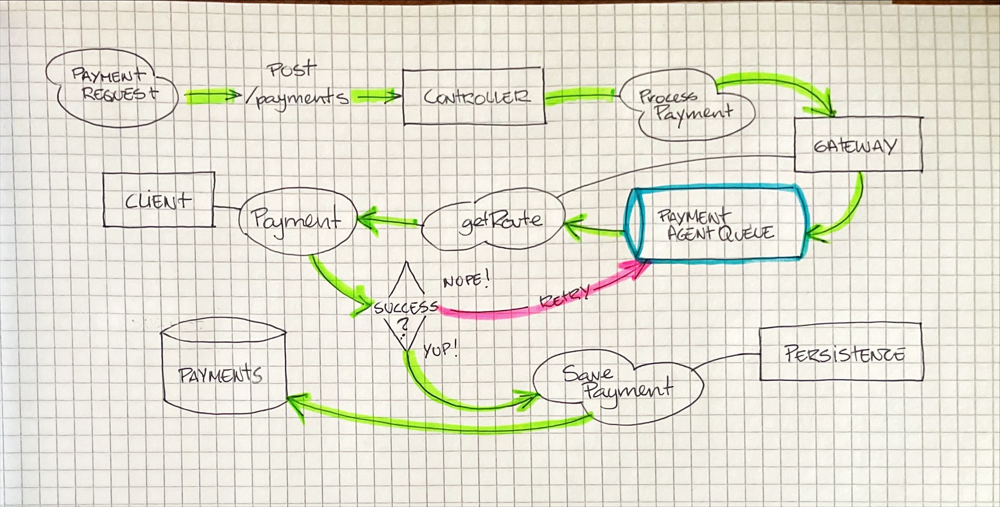

# Rinha de Backend 2025 - Payment processor

Minha submissão para a [Rinha de Backend 2025](https://github.com/zanfranceschi/rinha-de-backend-2025), que esse ano tem como tema **Payment processor**.

## Tecnologias Utilizadas
- [FSharp](https://fsharp.org)
- [PostgreSQL](https://www.postgresql.org)
- [.NET 9.0](https://dotnet.microsoft.com/download/dotnet/9.0)

## Repositório

O código-fonte da API pode ser encontrado no repositório abaixo:
- [Repositório da API](https://github.com/vhogemann/rinha-de-backend-2025-fsharp)

## Arquitetura

Eu decidi seguir o caminho mais simples possível utilizando soluções nativas em F#, a aplicação em si é um monolito.

A API REST é feita com o [Falco Framework](https://www.falcoframework.com). Um controller simples faz o parsing da requisição e chama um servio de Gateway que internamente define uma fila pra processar as transações usando o pattern [MailboxProcessor](https://fsharpforfunandprofit.com/posts/concurrency-actor-model/).

O Gateway tem referência pra duas instâncias do Client que efetua as requisições para os gatways de pagamento usando a biblioteca [FsHttp](https://github.com/fsprojects/FsHttp). Cada Client mantém uma fila interna que faz polling pro healthcheck dos gateways, e essa informação é usada pelo Gateway para decidir qual cliente usar. 

Caso a requisição falhe, o Gateway enfileira ela novamente para ser tentada novamente. Em caso de sucesso o serivço de Persistence salva a transação em uma tabela do PostgreSQL usando [Donald](https://github.com/pimbrouwers/Donald).

## Autor

Eu trabalho com desenvolvimento desde 2006, atualmente atuo como Senior Software Engineer e trabalho principalmente com Java. Já usei diversas linguagens de programação, mas a minha favorita ainda é F#.

  
  <a href="https://bsky.app/profile/victor.hogemann.com">
    
  

