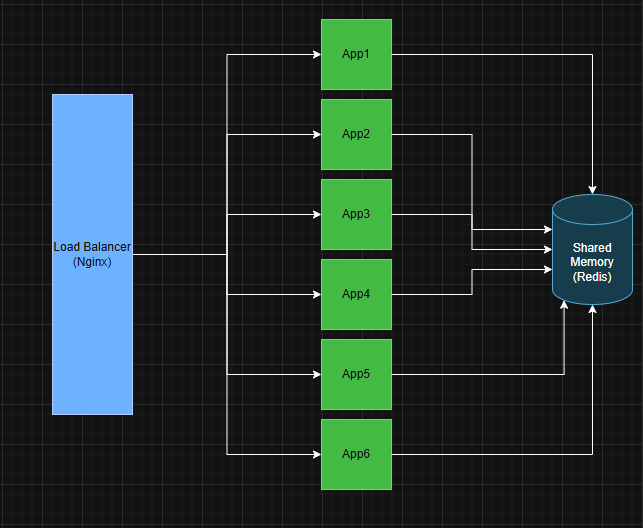

## Rinha backend 2025 - Lua + Lujit + Luvit + Redis

## Tecnologias utilizadas

- **Runtime/Linguagem** Lua / [Luavit (Lua like nodejs)](https://luvit.io/)
- **Banco de Dados** Redis
- **Load Balancer** Nginx

## Contexto

A ideia desse projeto foi utilizar Lua, mais especificamente utilizando a plataforma Luvit, que é uma plataforma que usa Luajit (Just in time compiler for lua), e utiliza a Libuv para prover o event loop não bloqueante.

## Arquitetura



## Repo: [Link](https://github.com/willianmarquess/rinha-2025-lua)

## Resultados

Embora cada serviço individualmente não consiga responder a uma grande quantidade de requisições em tempo quase real, eles consomem pouca memória (5 ~ 18mb) e CPU (max 1.2). Por isso, a estratégia adotada foi escalar horizontalmente, executando 6 instâncias do serviço simultaneamente.

(com 350mb e 1.5 cpu daria pra escalar para 10 serviços tranquilamente)

- Resultado abaixo com MAX_REQUESTS=550, executado localmente.

```json
{
  "participante": "anonymous",
  "total_liquido": 361197.80860515,
  "total_bruto": 333066.30000000005,
  "total_taxas": 23775.525,
  "descricao": "'total_liquido' é sua pontuação final. Equivale ao seu lucro. Fórmula: total_liquido + (total_liquido * p99.bonus) - (total_liquido * multa.porcentagem)",
  "p99": {
    "valor": "2.6087ms",
    "bonus": 0.16782600000000003,
    "max_requests": "550",
    "descricao": "Fórmula para o bônus: max((11 - p99.valor) * 0.02, 0)"
  },
  "multa": {
    "porcentagem": 0,
    "total": 0,
    "composicao": {
      "total_inconsistencias": 0,
      "descricao": "Se 'total_inconsistencias' > 0, há multa de 35%."
    }
  },
  "lag": {
    "num_pagamentos_total": 16737,
    "num_pagamentos_solicitados": 16737,
    "lag": 0,
    "descricao": "Lag é a diferença entre a quantidade de solicitações de pagamentos vs o que foi realmente computado pelo backend. Mostra a perda de pagamentos possivelmente por estarem enfileirados."
  },
  "pagamentos_solicitados": {
    "qtd_sucesso": 16737,
    "qtd_falha": 0,
    "descricao": "'qtd_sucesso' foram requests bem sucedidos para 'POST /payments' e 'qtd_falha' os requests com erro."
  },
  "pagamentos_realizados_default": {
    "total_bruto": 261844.2,
    "num_pagamentos": 13158,
    "total_taxas": 13092.210000000001,
    "descricao": "Informações do backend sobre solicitações de pagamento para o Payment Processor Default."
  },
  "pagamentos_realizados_fallback": {
    "total_bruto": 71222.1,
    "num_pagamentos": 3579,
    "total_taxas": 10683.315,
    "descricao": "Informações do backend sobre solicitações de pagamento para o Payment Processor Fallback."
  }
}
```