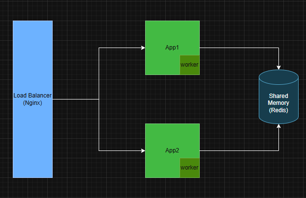

## Rinha backend 2025 - Nodejs + UWebsockets + Redis

## Tecnologias utilizadas

- **Runtime/Linguagem** Nodejs 22 / Javascript
- **Banco de Dados** Redis
- **Load Balancer** Nginx

## Contexto

A ideia desse projeto foi utilizar Node.js com JavaScript e UWebsockets e tem como principal objetivo demonstrar uma arquitetura assíncrona no backend. Cada serviço backend opera de forma independente, criando um worker dedicado para processar operações de maneira e eficiente, para realizar o sincronismo dos dados foi utilizado o Redis como banco de dados.

## Arquitetura

## Repo: [Link](https://github.com/willianmarquess/rinha-back-node-2025)