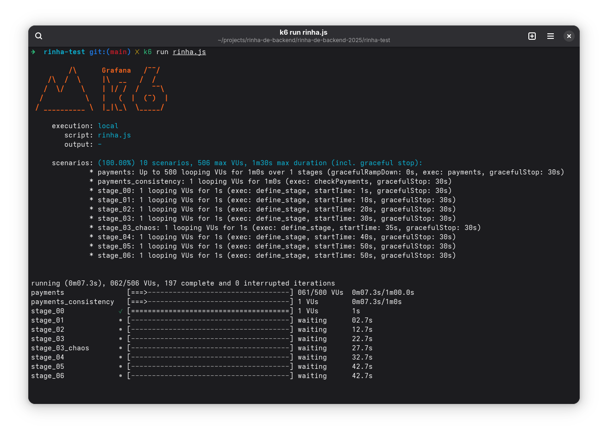

# Rinha de Backend - 2025

## Instruções para Execução dos Testes Locais

A ferramenta de testes para essa edição da Rinha de Backend é o [k6](https://k6.io/).


Instale o k6 caso ainda já não o tenha feito. Siga as instruções [aqui](https://grafana.com/docs/k6/latest/set-up/install-k6/).

### Execução dos Testes

Antes de executar os testes, você precisa subir os containers do seu backend e dos [Payment Processors](../payment-processor/docker-compose.yml). Após ter feito isso, basta entrar no diretório [rinha-test](./) e executar o seguinte comando:

```shell
k6 run rinha.js
```

Você deverá ver algo como a imagem seguinte.



### Acompanhando os Testes via Dashboard e Report

Se quiser acompanhar os testes via dashboard e obter um relatório HTML do k6, você pode configurar as seguintes variáveis de ambiente. Para mais informações, acesse a [documentação oficial](https://grafana.com/docs/k6/latest/results-output/web-dashboard/).


```shell
export K6_WEB_DASHBOARD=true
export K6_WEB_DASHBOARD_PORT=5665
export K6_WEB_DASHBOARD_PERIOD=2s
export K6_WEB_DASHBOARD_OPEN=true
export K6_WEB_DASHBOARD_EXPORT='report.html'
```

### Número Máximo de Requisições Simultâneas

Se quiser alterar o número máximo de requisições simultâneas, você poderá definiar a variável `MAX_REQUESTS` no comando para executar o teste em vez de alterar o script.

```shell
k6 run -e MAX_REQUESTS=550 rinha.js
```

### Contribuição com o Script de Teste

O script de testes foi feito por mim (Zan), mas como não tenho proficiência em Javascript, muito provavelmente existem muitos pontos de melhoria. Sugestões de melhoria no script de testes são muito bem-vindas! Abra um PR e contribua!
